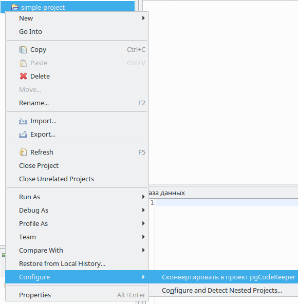
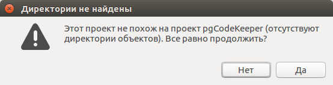

===================
Конвертация проекта
===================

Любой проект можно сконвертировать в проект pgCodeKeeper. Для этого из меню проекта выберите пункт **Configure -> Convert to pgCodeKeeper project.**

В некоторых случаях может потребоваться выбрать тип проекта: PostgreSQL или MS SQL.

.. image:: ../images/convert_project_choice.png

Если структура проекта не соответствует стандарту, будет показано предупреждение.

