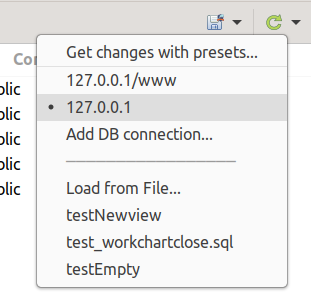

===========================
Выбор источника базы данных
===========================

Для удобства выбора источника базы данных в различных частях плагина используется выпадающий список и контекстное меню кнопки ⯆ рядом с |refresh|, который состоит из списка баз данных и 3-х последних дамп-файлов.

Список баз данных находится в :ref:`dbStore`, в который можно перейти по пункту **Add DB connection / Добавить подключение к БД** в контекстном меню кнопки ⯆ рядом с |refresh|.

Для выбора файл-дампа необходима выбрать элемент списка **Load from file... / Загрузить из файла...**. В открывшемся диалоговом окне выбираем нужный нам файл и нажимаем кнопку **OK**. Выбранный файл добавлен в список источников баз данных.

.. |refresh| image:: ../images/pgcodekeeper_project_view/refresh.png