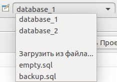

===========================
Выбор источника базы данных
===========================

Для удобства выбора источника базы данных в различных частях плагина используется выпадающий список, который состоит из списка баз данных и 3-х последних дамп-файлов.

Список баз данных находится в :ref:`dbStore`, в которое можно перейти по кнопке **Open DB store / Открыть хранилище БД**, находящейся слева от списка.

Для выбора файл-дампа необходима выбрать элемент списка **Load from file... / Загрузить из файла...**. В открывшемся диалоговом окне выбираем нужный нам файл и нажимаем кнопку **OK**. Выбранный файл добавлен в список источников баз данных.