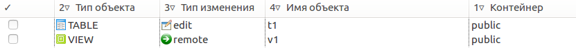
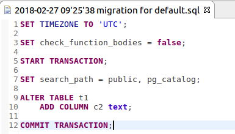
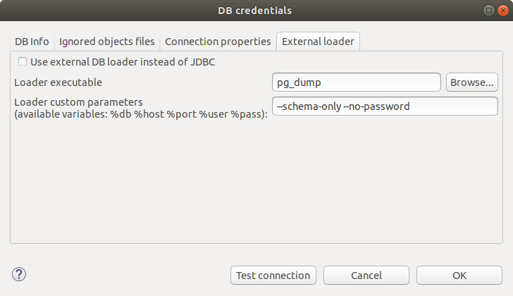
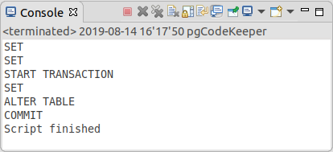

================================
Обновление удаленной базы данных
================================

На **Панель инструментов Eclipse** указываем параметры для получения схемы БД, на основании которой будет сгенерирован DDL скрипт для применения изменений к удаленной базе данных.

На панели действий нажимаем кнопку **Get changes / Получить изменения**. После недолгого ожидания на панели различий отображается список объектов с указанием типа изменения.

Выбираем направление изменений **БД / DB**, флажками отмечаем необходимые изменения, нажимаем на кнопку **Применить / Apply**.

После окончания генерации скрипта откроется SQL редактор. Проверяем сгенерированный скрипт, при необходимости вносим изменения самостоятельно.

Для применения скрипта наката к базе данных необходимо указать способ его выполнения. По умолчанию используется обновление через JDBC. При необходимости использования другой утилиты или параметров запуска можно изменить настройки текущей БД. Подробнее :ref:`dbStore`.

После выбора способа обновления и ввода необходимых параметров нажмите кнопку Обновить DDL или горячей клавишей (по-умолчанию Ctrl+Alt+R). Скрипт наката будет применен для указанной базы данных. Текущий прогресс отображается в консоли pgCodeKeeper.

Для большей гибкости имеется возможность наката выделенного фрагмента кода.