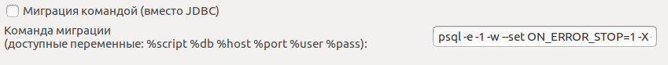

================================
Обновление удаленной базы данных
================================

На **тулбаре** указываем параметры для получения схемы БД, на основании которой будет сгенерирован DDL скрипт для применения изменений к удаленной базе данных.

На панели действий нажимаем кнопку **Получить изменения**. После недолгого ожидания на панели различий отображается список объектов с указанием типа изменения.

.. image:: ../images/changes_list.png

Флажками отмечаем объекты которые мы хотим обновить, нажимаем на кнопку **Применить к базе данных**.

После окончания генерации скрипта откроется SQL редактор. Проверяем сгенерированный скрипт, при необходимости вносим изменения самостоятельно.

.. image:: ../images/sql_editor.png

Для применения скрипта наката к базе данных необходимо указать способ его выполнения. По умолчанию используется обновление через JDBC. При необходимости использования другой утилиты или параметров запуска возможно можно использовать команду, настраиваемую на странице настроек :ref:`dbUpdate`.

После выбора способа обновления и ввода необходимых параметров нажмите кнопку Обновить DDL или горячей клавишей (по-умолчанию Ctrl+Alt+R). Скрипт наката будет применен для указанной базы данных. В случае успешного применения изменений в консоли pgCodeKeeper появится соответствующее сообщение.

Для большей гибкости имеется возможность наката выделенного фрагмента кода.