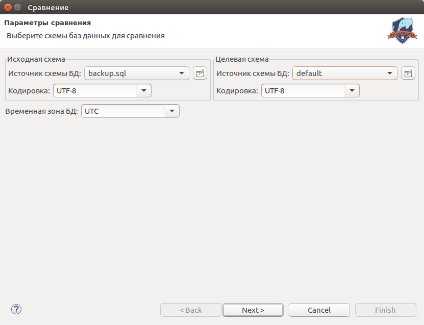
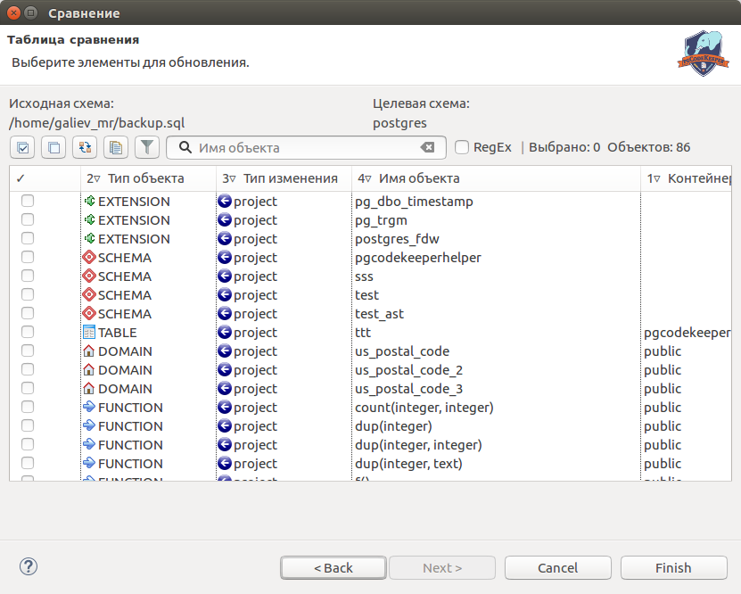

====================
Сравнение баз данных
====================

- Открываем мастер сравнения баз данных: **pgCodeKeeper - Diff Wizard / Мастер сравнения** или вызываем контекстное меню pgCodeKeeper проекта и выбираем **pgCodeKeeper - Diff... / Сравнить...**. 
- Выбираем источник исходной схемы базы данных, которую нужно обновить, и целевой схемы базы данных, на основании которой обновляем исходную базу данных. 
- Выбираем дополнительные параметры: кодировки источников и временную зона БД. 
- При использовании MS SQL дампа, выбираем соответствующую опцию. 
- Нажимаем кнопку **Next**.

В таблице сравнения отмечаем изменения, которые необходимо применить.
Примечание: панель инструментов работает аналогично панели инструментов редактора проектов pgCodeKeeper.

При нажатии кнопки **Finish** откроется SQL редактор со скриптом миграции, сгенерированным для выбранных изменений.