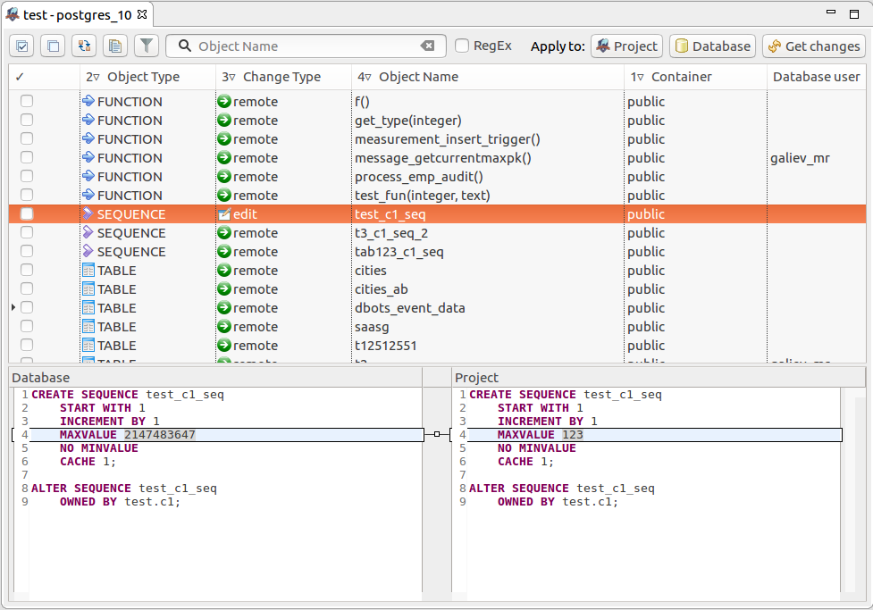
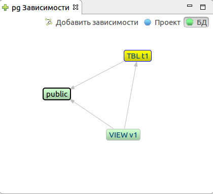
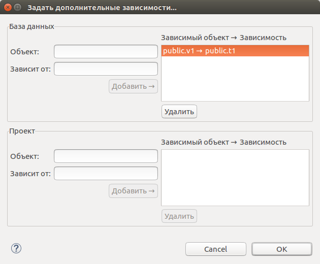
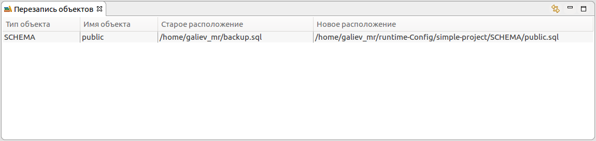
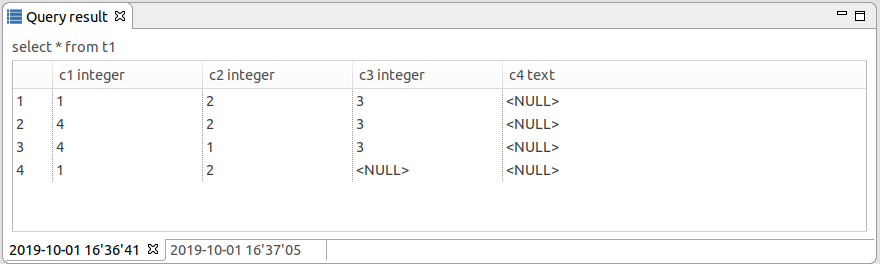

==================
Редакторы и панели
==================

.. _projEditor :

Редактор проекта pgCodeKeeper
~~~~~~~~~~~~~~~~~~~~~~~~~~~~~

Редактор проекта – основной способ работы с pgCodeKeeper. Интерфейс редактора, состоящий из нескольких основных частей:

#. Панель инструментов Eclipse
#. Панель инструментов редактора
#. Таблица различий
#. Панель сравнения
#. Счетчик объектов

**Панель инструментов Eclipse** содержит инструменты для выбора источника данных, с которым предстоит работать. Кнопка |file| позволяет открыть новый :ref:`sqlEditor`.

**Панель инструментов редактора** предназначена для работы со списком объектов. Существуют следующие возможности:

- |check_all| – выбрать все элементы.
- |uncheck_all| – снять выбор со всех элементов.
- |loop_obj| – инвертировать выбор элементов.
- |copy_edit| – копировать набор выбранных элементов в буфер обмена как регулярное выражение.
- |empty_filter| / |filter_tsk| - неактивный / активный фильтр объектов.
- Отфильтровать список объектов по имени или регулярному выражению.
- Применить изменения
- Переключить направление изменений
- |refresh| Получить изменения

Кнопки ⯆ позволяют запустить операции получения или применения изменений к БД с одноразовым переопределением некоторых настроек.

**Таблица различий** отображает список объектов, которые различаются в сравниваемых схемах БД. Здесь доступна информация: тип объекта, тип изменения, имя объекта, контейнер, пользователь git, пользователь базы данных.

Тип объекта - поддерживаются следующие типы объектов: SCHEMA, TYPE, SEQUENCE, TABLE, FUNCTION, PROCEDURE, VIEW, CONSTRAINT, INDEX, TRIGGER.

Для **PostgreSQL** дополнительно поддерживаются следующие типы: CAST, EXTENSION,  DOMAIN, OPERATOR, FTS_PARSER, FTS_TEMPLATE, FTS_DICTIONARY, FTS_CONFIGURATION, AGGREGATE, RULE, POLICY.

Для **MS SQL** дополнительно поддерживаются следующие типы: USER, ROLE, ASSEMBLY.

Тип изменения - объект может находиться в трех состояниях: существовать только в базе данных, только в проекте или и в проекте и в базе данных. В зависимости от состояния и направления изменений, объекты в списке изменений помечаются как delete, add и edit или CREATE, DROP и ALTER соответственно.

Контейнер - имя родительского объекта, например для индекса - это имя таблицы или представления, которому он принадлежит.

Пользователь git - имя пользователя, который последним изменил файл проекта для данного объекта. В том случае, если файлы были изменены локально, то к имени пользователя будет добавлен символ '*'. Для отображения данного столбца, проект должен быть подключен к системе контроля версий и должна быть включена соответствующая опция на странице настроек :ref:`projEditorPref`.

Пользователь базы данных - имя пользователя базы данных, который последним изменил объект в базе данных. Для отображения данного столбца необходимо расширение `pg_dbo_timestamp <https://github.com/pgcodekeeper/pg_dbo_timestamp/>`_.

**Панель сравнения** показывает изменения, произошедшие в SQL представлении объекта.

**Счетчик объектов** отображает выбранное и общее количество объектов в таблице.

.. |check_all| image:: ../images/pgcodekeeper_project_view/check_all.gif
.. |uncheck_all| image:: ../images/pgcodekeeper_project_view/uncheck_all.gif
.. |loop_obj| image:: ../images/pgcodekeeper_project_view/loop_obj.gif
.. |copy_edit| image:: ../images/pgcodekeeper_project_view/copy_edit.png
.. |empty_filter| image:: ../images/pgcodekeeper_project_view/empty_filter.png
.. |filter_tsk| image:: ../images/pgcodekeeper_project_view/filter_tsk.png
.. |file| image:: ../images/pgcodekeeper_project_view/add_file.png

.. _sqlEditor :

SQL редактор
~~~~~~~~~~~~

SQL редактор внешне не отличается от обычного текстового редактора Eclipse, но в нем имеется возможность подсветки синтаксиса SQL, автоподстановки шаблонов SQL запросов и навигации по объектам схемы базы данных.

.. image:: ../images/autocomplete.png

При работе с SQL редактором в **панели инструментов Eclipse** доступны следующие возможности:

| |quick_update| - Quick update / Быстрое обновление. Исполнение скрипта миграции для **различий** между объектом в текущем файле проекта и соответствующим объектом в базе данных. Если изменения затрагивают объекты из других файлов или модифицируют данные (например удаление колонки), то обновление не произойдет.
| |update_ddl| - Execute selection / Выполнить выбранное. Исполнение текущего скрипта миграции (или выделенного текста) в выбранной базе данных.
| |progress_stop| - Cancel execution / Отменить выполнение. Отмена исполнения текущего скрипта миграции. 
| |refresh| - Get changes / Получить изменения. Обновляет редактор проекта, в котором находится текущий файл. Применимо только к файлам проекта.

.. |quick_update| image:: ../images/pgcodekeeper_project_view/quick_update.png
.. |update_ddl| image:: ../images/pgcodekeeper_project_view/update_ddl.gif
.. |progress_stop| image:: ../images/pgcodekeeper_project_view/progress_stop.gif
.. |refresh| image:: ../images/pgcodekeeper_project_view/refresh.png

Просмотр зависимостей объекта БД
~~~~~~~~~~~~~~~~~~~~~~~~~~~~~~~~

Панель **pg Dependencies / pg Зависимости** показывает зависимости, в которых участвует текущий объект, выбранный в панели различий активного редактора проекта.

Стрелки указывают на направление связи от зависящего объекта к его зависимости.

Переключатель **Project - Remote / Проект - БД** позволяет выбрать, для какой БД, участвующей в сравнении, показывать объекты и зависимости. После переключения необходимо повторно выбрать элемент в панели различий редактора.

Кнопка **Add depcy / Добавить зависимости** позволяет открыть диалог ручного добавления зависимостей.

В этом диалоге можно явно задать зависимости между объектами БД. Это может понадобиться, например, в случае если автоматическое распознавание зависимостей не сработает для некоторой сложной зависимости. Добавленные зависимости будут учтены при генерации последовательности выражений скрипта наката.

Окно состоит из двух частей, которые служат для добавления зависимостей к сравниваемым БД.

Для добавления зависимостей между объектами, достаточно ввести начальные буквы из названия объекта и из выпадающего списка выбрать имена зависимых объектов и нажать на кнопку **Add / Добавить**. Зависимость отобразится в списке добавленных.

Для удаления выделите связку зависимых объектов и нажмите **Remove / Удалить**.

.. _overrideView :

Переопределенные объекты
~~~~~~~~~~~~~~~~~~~~~~~~

Панель **Object overrides / Переопределенные объекты** отображает список переопределенных объектов в библиотеках для активного редактора проекта. Данный вид автоматически отображается при получении изменений, если присутствуют хотя бы один конфликт.

Кнопка |sync| отображает записи, относящиеся только к объектам, выбранным в панели различий активного редактора проекта.

.. |sync| image:: ../images/pgcodekeeper_project_view/synced.gif

Контекстное меню позволяет открыть обе версии объекта, а также просмотреть различия в специальном редакторе сравнения.

Результат запроса
~~~~~~~~~~~~~~~~~

Панель **Query result / Результат запроса** отображает результат запросов. Каждый запрос отображается отдельной вкладкой.

