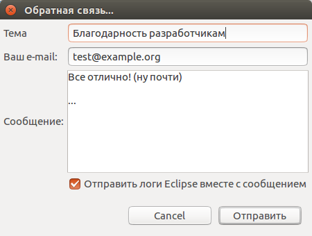

==============
Обратная связь
==============

Пользователь имеет возможность отправить сообщение разработчикам непосредственно из среды разработки. Для этого необходимо в меню **pgCodeKeeper** выбрать пункт **Feedback / Обратная связь**. Откроется окно отправки сообщений.

.. note:: Пункт главного меню **pgCodeKeeper** отображается при использовании перспективы Eclipse **pgCodeKeeper**. Для переключения перспективы Eclipse воспользуйтесь пунктом меню **Window -> Perspective -> Open Perspective** или панелью быстрого переключения (по-умолчанию находится в верхнем правом углу Eclipse).

Заполняем необходимые поля. Желательно указать корректный электронный адрес для обратной связи. После заполнения полей нажать кнопку **Send / Отправить**.

.. note:: При сообщении об ошибке рекомендуется отметить флажком пункт **Send Eclipse logs with your message / Отправить логи Eclipse вместе с сообщением** для отправки более подробной информации.