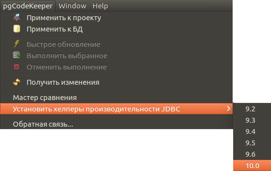

==========================
Хелперы производительности
==========================

Для ускорения загрузки данных, можно установить хелперы произволительности.

Для этого открываем выбираем пункт меню: **pgCodeKeeper - Установить хелперы производительности - Версия сервера**.

Будет открыт SQL редактор с сформированным скриптом, который можно накатить на базу данных.