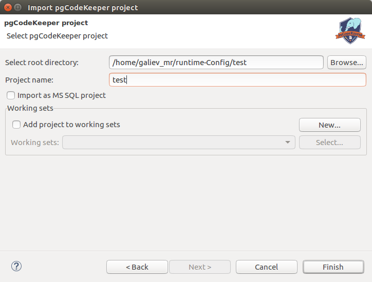

==============
Импорт проекта
==============

Если имеется проект Eclipse (такой проект имеет файл .project в корне), то производится импорт существующего проекта:

1. Из меню выберите пункт **File -> Import...** Откроется выбор мастеров импорта.
2. Выберите категорию **General -> Existing Project into Workspace** и нажмите **Next**.
3. Выберите директорию проекта.
4. Затем выберите проекты для импорта.
5. Закончите импорт нажатием на **Finish**.

В случае, если присутствует только структура проекта pgCodeKeeper, без файлов проекта Eclipse, то импорт производится с помощью мастера импорта. Хранение структуры проекта pgCodeKeeper без информации Eclipse – обычная практика, например при использовании системы контроля версий.

1. Из меню выберите пункт **File -> Import** ... Откроется выбор мастеров импорта.
2. Выберите **pgCodeKeeper Project** в категории pgCodeKeeper и нажмите **Next**.

3. Укажите путь до директории со структурой проекта pgCodeKeeper, введите имя проекта и выберите его кодировку.
4. Если импортируемый проект для MS SQL, то необходимо выбрать соответствующую опцию.
5. Для добавления проекта в рабочую область, можно выбрать соответствующую опцию.
6. Нажмите **Finish**.

Для корректной работы проект должен содержать файл '.pgcodekeeper' в корне директории. Мастер импорта проекта автоматически создаст данный файл при его отсутствии.