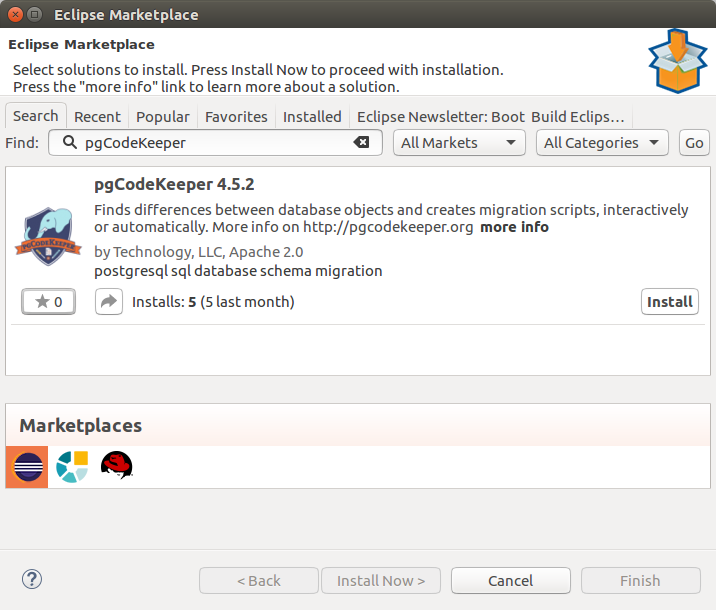
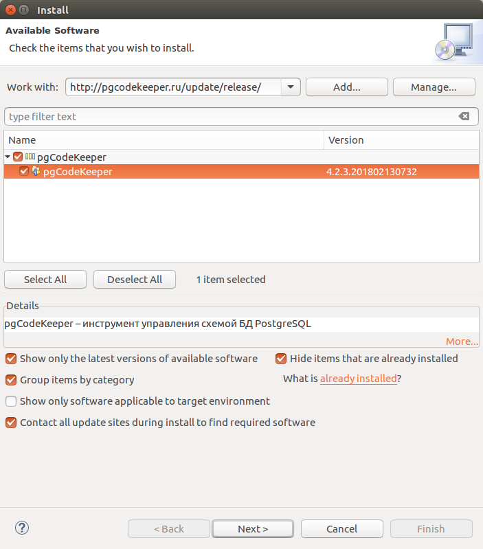

=========
Установка
=========

Eclipse Marketplace
~~~~~~~~~~~~~~~~~~~

Самый простой путь установить pgCodeKeeper - Eclipse Marketplace : в запущенном экземпляре Eclipse версии 4.2 или выше с установленным Eclipse Marketplace, выбрать **Help > Eclipse Markeplace...**. 

В поле поиска ввести: pgCodeKeeper.

Выберите пакет pgCodeKeeper, ознакомьтесь с пользовательским соглашением, нажмите кнопку Finish и начнется установка.

По завершению установки для применения изменений необходимо перезапустить Eclipse.

Запустите Eclipse и выберите **Window > Perspective > Open Perspective > Other > pgCodeKeeper**.

Сайт обновления
~~~~~~~~~~~~~~~

Альтернативный путь получить установки pgCodeKeeper – сайт обновлений: в запущенном экземпляре Eclipse версии 4.2 или выше, выбрать **Help > Install New Software...** Откроется мастер установки плагинов средствами сайта обновлений.

В поле **Work With** ввести путь к сайту обновлений: http://pgcodekeeper.org/update/.

После нажатия **Enter** в списке ниже появятся доступные для установки плагины.

Выберите пакет pgCodeKeeper, согласитесь с установкой, ознакомьтесь с пользовательским соглашением, нажмите кнопку **Finish** и начнется установка.

По завершению установки для применения изменений необходимо перезапустить Eclipse.

Запустите Eclipse и выберите **Window > Perspective > Open Perspective > Other > pgCodeKeeper**.