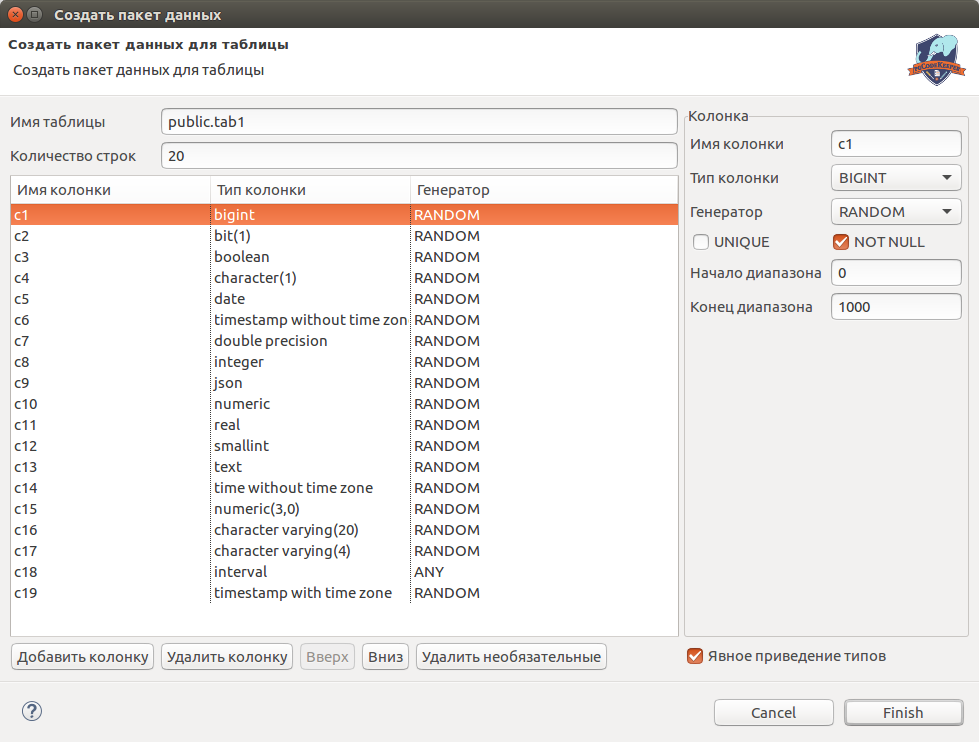
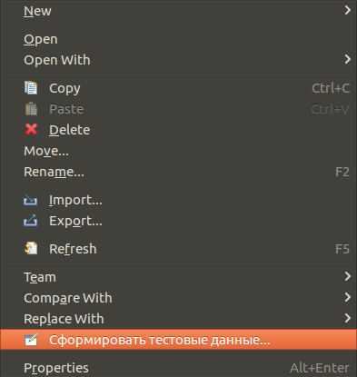

=========================
Генерация тестовых данных
=========================

Существует возможность генерации тестовых данных для таблицы в виде **Insert** конструкции:

Для этого откройте мастер создания нового объекта **File -> New -> Others** и выберите категорию **pgCodeKeeper -> Сформировать тестовые данные** и нажмите **Next**.

Для каждой колонки в зависимости от типа и генератора доступны следующие настройки:

- **Имя колонки** - имя текущей колонки.
- **Тип колонки** - тип данных колонки. Для неподдерживаемых типов существует тип OTHER.
- **Генератор** - алгоритм генерации данных. На данный момент их 4:

:RANDOM: Случайное значение из диапазона.
:INCREMENT: Последовательное увеличение стартового значения на значение инкремента.
:CONSTANT: Константное значение. Текстовые значения будут заключены в одинарные кавычки.
:ANY: Любое значение (включая вызовы функций). Значение не будет отформатировано.

- **Начало диапазона** - стартовое значение
- **Конец диапазона** - конечное значение
- **Шаг инкремента** - значение шага инкремента
- **Произвольное выражение** - произвольное значение, которое будет записано без форматирования.

Для управления списком колонок доступны следующие кнопки:

- **Добавить колонку** добавляет колонку типа INTEGER с генератором RANDOM.
- **Удалить колонку** удаляет выбранные колонки.
- **Вверх** передвигает выбранную колонку вверх в списке.
- **Вниз** передвигает выбранную колонку вниз в списке.
- **Удалить необязательные** удаляет колонки у которых нет свойства NOT NULL.

Настройка **Явное приведение типов** добавляет явное приведение типов для каждого значения (например, 7::integer).

После нажатия **Finish** будет открыт SQL редактор с готовым Insert запросом.

.. note:: Также имеется возможность вызвать данный мастер из контекстного меню файла таблицы. В этом случае данные заполнятся автоматически.

