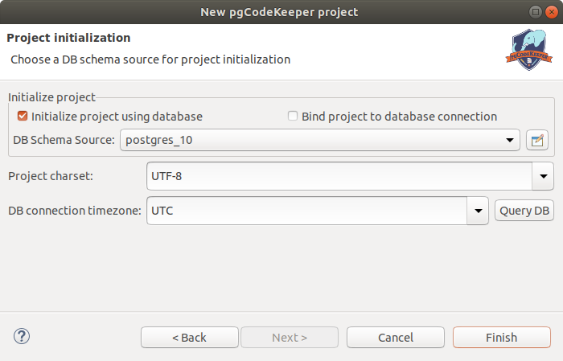

=======================
Создание нового проекта
=======================

- Открываем мастер создания нового проекта: **File -> New -> Project...**
- Выбираем **pgCodeKeeper Project** для работы с PostgreSQL или **pgCodeKeeper MS SQL Project** для работы с MS SQL в категории **pgCodeKeeper**. Нажимаем кнопку **Next**.
- Указываем имя проекта.
- При необходимости изменяем местоположение и рабочую область проекта.
- Нажимаем кнопку **Next**.

- Выбираем источник базы данных или отключаем параметр **Initialize project using database / Инициализировать проект базой данных**.
- Выбираем кодировку проекта.
- Выбираем временную зону подключения к БД (имеется возможность получить из текущей БД). Данный шаг не доступен для проектов MS SQL.
- Нажимаем кнопку **Finish**.

После короткого ожидания получаем новый проект и будет автоматически открыт :ref:`projEditor`.