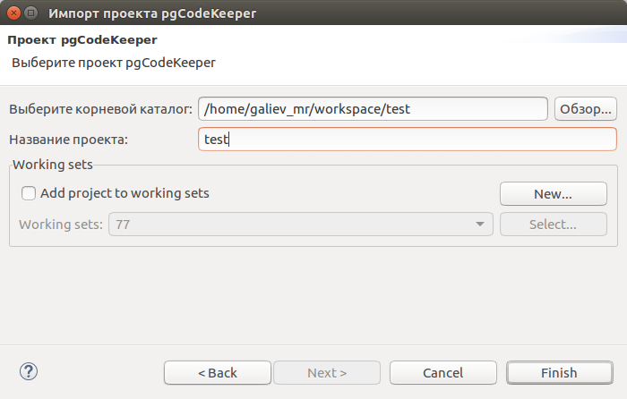

.. _my-reference-label:

Section to cross-reference
--------------------------

This is the text of the section.

It refers to the section itself, see :ref:`my-reference-label`.

============
New project
============

Открываем мастер создания нового проекта: **File -> New -> Project...**

Выбираем **Проект pgCodeKeeper**. Нажимаем кнопку **Next**.

Указываем имя проекта. Нажимаем кнопку **Next**.

Выбираем источник базы данных, кодировку проекта и временную зону подключения к БД (имеется возможность получить из текущей БД) или отключаем параметр "Инициализировать проект базой данных" и оставляем поля пустыми, а затем нажимаем кнопку **Finish**.

После короткого ожидания получаем новый проект и автоматически открывается :ref:`my-reference-label`.

.. end :

============
bla
============

Выбираем источник базы данных, кодировку проекта и временную зону подключения к БД (имеется возможность получить из текущей БД) или отключаем параметр "Инициализировать проект базой данных" и оставляем поля пустыми, а затем нажимаем кнопку **Finish**.Выбираем источник базы данных, кодировку проекта и временную зону подключения к БД (имеется возможность получить из текущей БД) или отключаем параметр "Инициализировать проект базой данных" и оставляем поля пустыми, а затем нажимаем кнопку **Finish**.Выбираем источник базы данных, кодировку проекта и временную зону подключения к БД (имеется возможность получить из текущей БД) или отключаем параметр "Инициализировать проект базой данных" и оставляем поля пустыми, а затем нажимаем кнопку **Finish**.Выбираем источник базы данных, кодировку проекта и временную зону подключения к БД (имеется возможность получить из текущей БД) или отключаем параметр "Инициализировать проект базой данных" и оставляем поля пустыми, а затем нажимаем кнопку **Finish**.Выбираем источник базы данных, кодировку проекта и временную зону подключения к БД (имеется возможность получить из текущей БД) или отключаем параметр "Инициализировать проект базой данных" и оставляем поля пустыми, а затем нажимаем кнопку **Finish**.Выбираем источник базы данных, кодировку проекта и временную зону подключения к БД (имеется возможность получить из текущей БД) или отключаем параметр "Инициализировать проект базой данных" и оставляем поля пустыми, а затем нажимаем кнопку **Finish**.Выбираем источник базы данных, кодировку проекта и временную зону подключения к БД (имеется возможность получить из текущей БД) или отключаем параметр "Инициализировать проект базой данных" и оставляем поля пустыми, а затем нажимаем кнопку **Finish**.