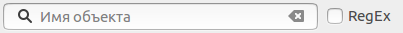
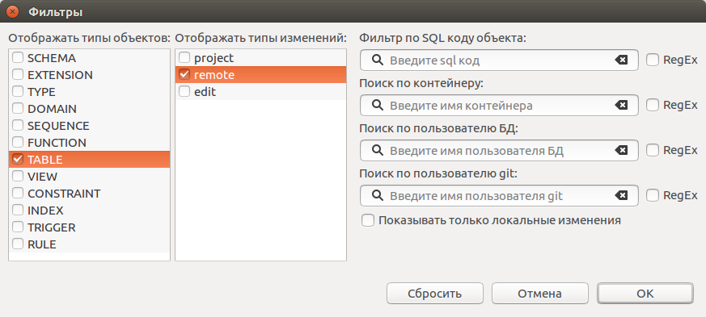

=============
Поиск объекта
=============

Поиск объекта в таблице изменений
~~~~~~~~~~~~~~~~~~~~~~~~~~~~~~~~~

Для поиска объектов в таблице изменений удобно воспользоваться полем поиска над списком изменений.

Поиск происходит по именам объектов. При установленном флажке **RegEx** поиск осуществляется с использованием регулярных выражений.

Для начала просто введите часть имени в поле поиска. В таблице изменений отобразятся объекты, соответствующие данному условию.

Поле поиска хранит последние 200 запросов.

Фильтры объектов
~~~~~~~~~~~~~~~~

Для фильтрации объектов можно использовать диалоговое окно, которой отобразится при нажатии кнопки |empty_filter| над списком изменений. 

Список типов объектов позволяет отобразить только выбранные типы объектов. Если выбран тип TABLE или VIEW будут отображены все дочерние объекты.

Список типов изменений позволяет отобразить только выбранные типы изменений.

**Filter by object's SQL code / Фильтр по SQL коду объекта** ищет в совпадения коде генерации объектов.

**Search by container / Поиск по контейнеру** ищет объекты, находящиеся в схемах с подходящими именами. Также будут отображены и сами объекты схем.

**Search by database user / Поиск по пользователю БД** ищет совпадения по авторам изменений объектов в сторонней базе данных. Для использования необходимо расширение `pg_dbo_timestamp <https://github.com/pgcodekeeper/pg_dbo_timestamp/>`_.

**Search by git user / Поиск по пользователю git** ищет совпадения по авторам последного изменений объекта в локальном репозитории. Для использования проект должен находиться под системой контроля версий.

**Show only local changes / Показывать только локальные изменения** отображает изменения произошедшие в локальном репозитории, с момента последнего коммита. Для использования проект должен находиться под системой контроля версий.

**Hide library objects / Скрывать библиотечные объекты** скрывает объекты загруженные из библиотек.

Для применения фильтров нажмите кнопку **ОК**.

Для отмены текущих изменений нажмите кнопку **Cancel / Отмена**.

Для сброса всех фильтров нажмите кнопку **Reset / Сбросить**.

При включенном фильтре иконка кнопки изменится на |filter_tsk|.

.. |empty_filter| image:: ../images/pgcodekeeper_project_view/empty_filter.png
.. |filter_tsk| image:: ../images/pgcodekeeper_project_view/filter_tsk.png