====================
Глобальные настройки
====================

Основные настройки pgCodeKeeper
~~~~~~~~~~~~~~~~~~~~~~~~~~~~~~~

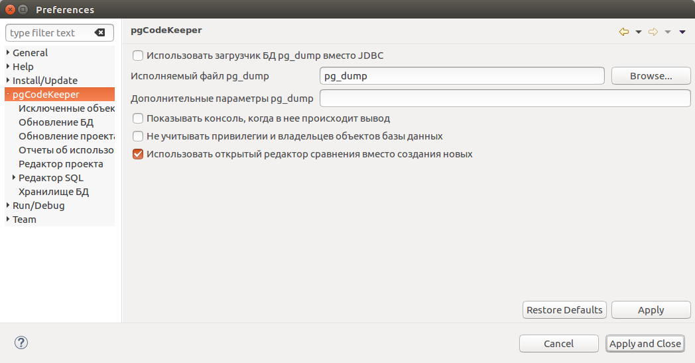

- **Use pg_dump DB loader instead of JDBC / Использовать загрузчик pg_dump** - для загрузки базы данных использовать pg_dump вместо JDBC.
- **pg_dump executable / Исполняемый файл pg_dump** - путь к утилите pg_dump, либо к другому исполняемому файлу или скрипту, реализующему интерфейс pg_dump.
- **pg_dump custom parameters / Дополнительные параметры pg_dump** - позволяет задавать дополнительные параметры вызова утилиты pg_dump.
- **Use pg_dbo_timestamp extension / Использовать расширение pg_dbo_timestamps** - позволяет использовать расширение `pg_dbo_timestamp <https://github.com/pgcodekeeper/pg_dbo_timestamp/>`_. Расширение позволяет ускорить загрузку схем базы данных, а также позволяет отображать в редакторе колонку с пользователем базы данных, совершившем последнее изменение объекта.
- **Show console on new output / Показывать консоль** - позволяет автоматически показывать консоль программы при выводе в нее.
- **Ignore privileges and owners of database objects / Не учитывать привилегии и владельцев объектов** - позволяет отключить поиск различий в свойствах объектов, связанных с ролями БД.
- **Reuse compare editor instead of opening new ones / Использовать открытый редактор сравнения вместо создания новых** - позволяет использовать открытый редактор сравнения при сравнения объектов базы данных (В контекстном меню таблицы различий выбрать пункт **Показать различия**).

.. _ignoredObjects :

Исключенные объекты
~~~~~~~~~~~~~~~~~~~

Объекты, которые не должны учитываться при сравнении БД, возможно указать на странице настроек **pgCodeKeeper -> Исключенные объекты**.

Для добавления объекта в список исключенных или удаления из него, служат кнопки |add_obj| и  |delete| соответственно.

При добавлении объекта в список исключенных можно выставить дополнительные настройки, которые влияют на исключение объекта при сравнении:

- **Шаблон** – является ли имя объекта регулярным выражением.
- **Игнорировать содержимое** – позволяет пропустить объекты, вложенные в исключенный.
- **Тип** – тип объекта ("ALL" предназначен для указания любого типа объекта).

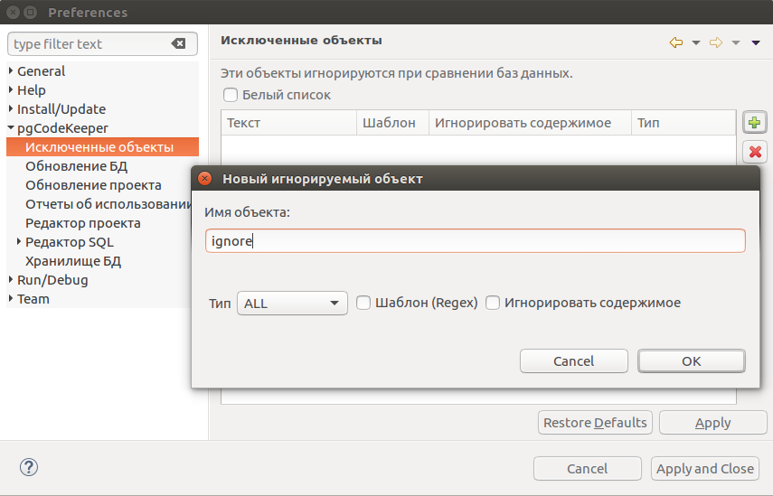

Все настройки списка доступны для редактирования.

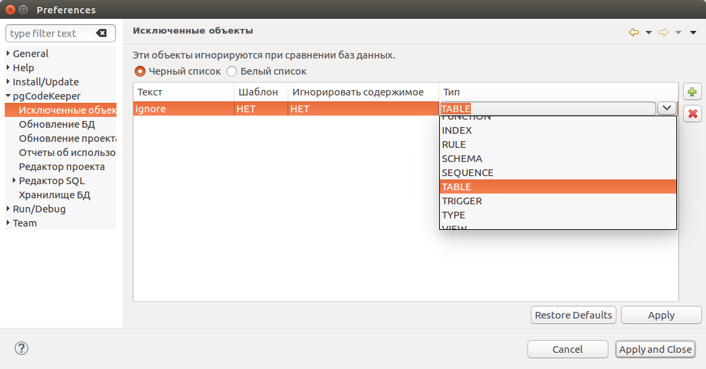

.. note:: В данном случае список исключаемых объектов будет **общим** и будет распространять свое действие на все проекты находящиеся в директории проектов. Подробное описание работы со списками находится в разделе :ref:`ignoreList`.

Переключатель **Черный список** - **Белый список** позволяет инвертировать черный список в белый и обратно.

**Примеры работы с исключенными объектами**

Предположим имеются представление с именем ignore4 и набор таблиц с именами: ignore, ignore2, ignore3. ignore2 в свою очередь содержит индекс idx2.

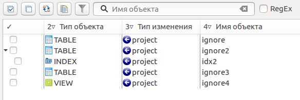

.. table::

    +----------------------------------------------+---------------------------------------------------+
    | Список исключенных объектов                  | Результат                                         |
    +==============================================+===================================================+
    | **Исключение объектов частично попадающих под регулярное выражение "ignore"**                    |
    +----------------------------------------------+---------------------------------------------------+
    | .. image:: ../images/ignore_list_pattern.png | .. image:: ../images/ignore_list_pattern_diff.png |
    +----------------------------------------------+---------------------------------------------------+
    | **Исключение объектов "ignore2" с содержимым**                                                   |
    +----------------------------------------------+---------------------------------------------------+
    | .. image:: ../images/ignore_list_content.png | .. image:: ../images/ignore_list_content_diff.png |
    +----------------------------------------------+---------------------------------------------------+
    | | **Исключение объектов с типом “TABLE” частично попадающих**                                    |
    | | **под регулярное выражение "ignore"**                                                          |
    +----------------------------------------------+---------------------------------------------------+
    | .. image:: ../images/ignore_list_type.png    | .. image:: ../images/ignore_list_type_diff.png    |
    +----------------------------------------------+---------------------------------------------------+

.. _dbUpdate :

Обновление БД
~~~~~~~~~~~~~
Настройки, управляющие обновлением базы данных.

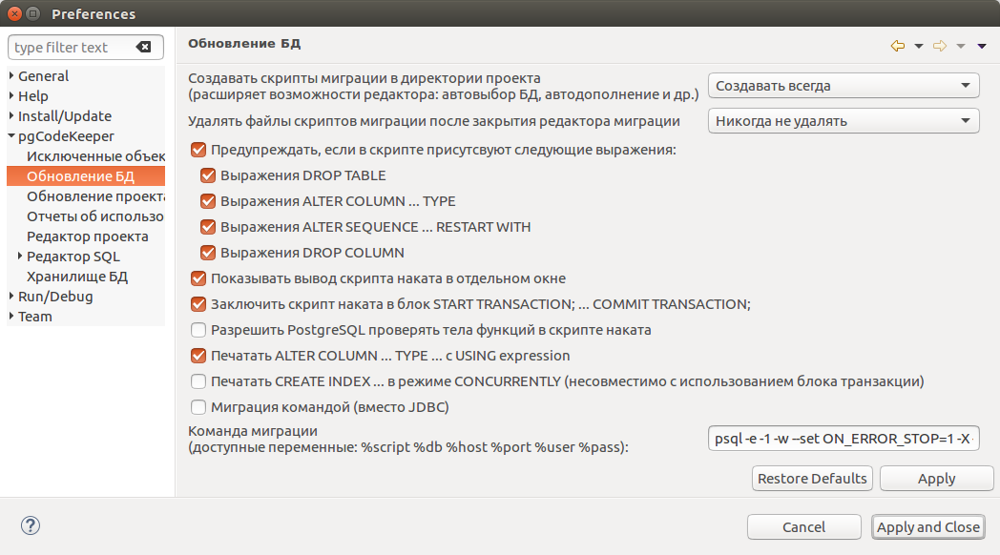

На странице настроек **pgCodeKeeper -> Обновление БД** Вы можете настроить параметры для работы редактора скрипта наката.

- **Create migration script files in project directory / Создавать скрипт миграции в директории проекта** – определяет поведение при создании скриптов миграции. 
- **Delete migration script files when closing migration editor / Удалять файлы скриптов миграции после закрытия редактора** – определяет поведение при закрытии скриптов миграции, если они были созданы в директории проекта.
- **Warn about dangerous scripts containing: / Предупреждать, если в скрипте присутствуют следующие выражения:** – позволяет предупреждать, если при генерации скрипта образовались выбранные опасные выражения.
- **Show script output in separate window / Показывать вывод скрипт наката в отдельном окне** – позволяет просмотреть сообщение с ответом сервера при выполнении наката.
- **Surround migration script with START TRANSACTION; ... COMMIT TRANSACTION; / Заключить скрипт наката в блок START TRANSACTION; ... COMMIT TRANSACTION;** – позволяет дополнять генерируемые скрипты парой start ... commit.
- **Allow PostgreSQL to validate function bodies in DDL update script / Разрешить PostgreSQL проверять тела функций в скрипте наката** – позволяет при генерации скрипта добавлять проверку "SET check_function_bodies = true;" в начало скрипта.
- **Print ALTER COLUMN ... TYPE with USING expression / Печатать ALTER COLUMN ... TYPE ... с USING expression** – позволяет добавлять в скрипт выражение, позволяющее изменить тип данных, при изменении типа столбца
- **Print CREATE INDEX ... in CONCURRENTLY mode / Печатать CREATE INDEX ... в режиме CONCURRENTLY** – позволяет в скриптах создавать индексы в режиме CONCURRENTLY. Такие индексы невозможно создать в блоке транзакции.
- **Migration command / Команда миграции** - позволяет использовать другую утилиту или параметры запуска при применении скрипта наката к базе данных.

Обновление проекта
~~~~~~~~~~~~~~~~~~

Настройки, управляющие обновлением проекта.

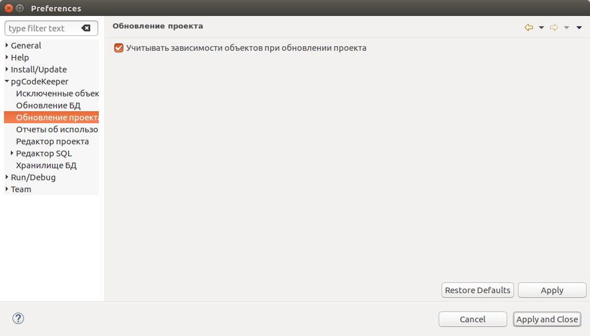

На странице настроек **pgCodeKeeper -> Обновление проекта** Вы можете включить учет зависимостей объектов при обновлении проекта. Это дополнит диалог наката выбранных объектов на проект их зависимостями, без которых накат на проект может происходить с ошибками.

Отчеты об использовании
~~~~~~~~~~~~~~~~~~~~~~~

Настройки, управляющие отправкой отчетов.

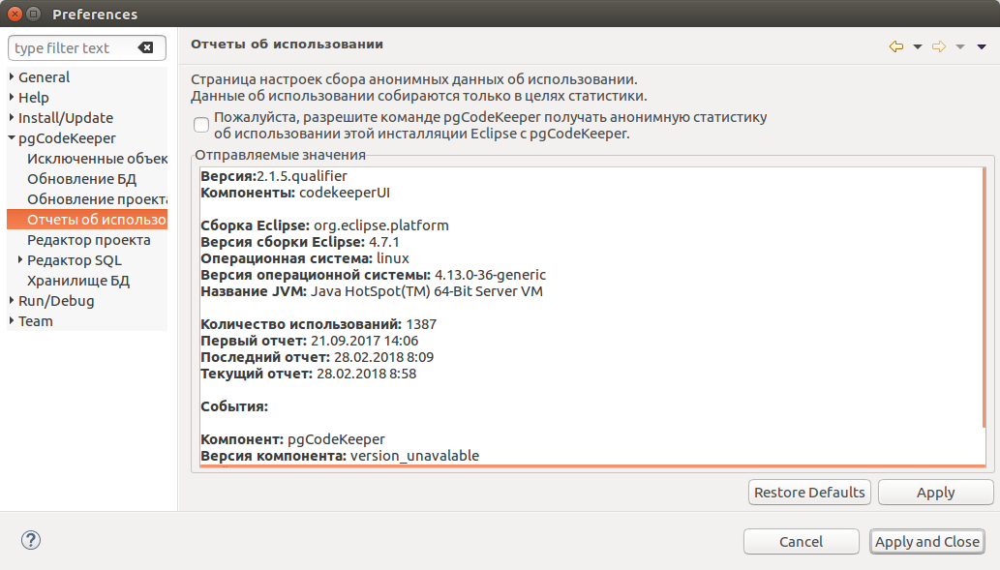

На странице настроек **pgCodeKeeper -> Отчеты об использовании** Вы можете включить или выключить отправление статистики об использовании pgCodeKeeper.

Отправляемые значения для статистики Вы можете просмотреть в поле **Reported Values / Отправляемые значения**.

.. _projEditorPref :

Редактор проекта
~~~~~~~~~~~~~~~~

Настройки, управляющие редактором проекта.

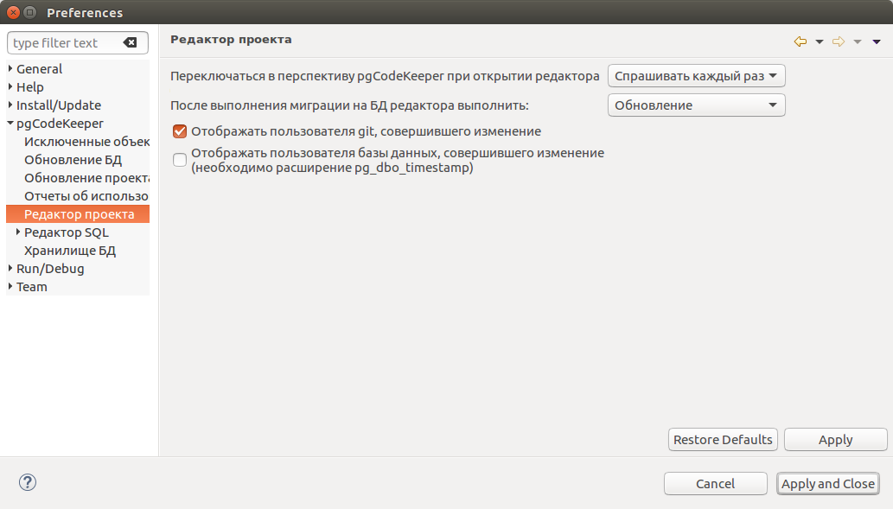

На странице настроек **pgCodeKeeper -> Редактор проекта** Вы можете настроить параметры редактора проекта.

- **Switch to pgCodeKeeper perspective when opening editor / Переключать в перспективу pgCodeKeeper при открытии редактора** – определяет поведение переключения перспективы при открытии редактора проекта. 
- **After applying a migration to editor's DB do: / После выполнения миграции на БД редактора выполнить:** – определяет поведение редактора при накате скриптов миграции.
- **Display git user that math the change / Отображать пользователя git, совершившего изменение** – позволяет отображать в редакторе колонку с пользователем git, совершившем последнее изменение файла. Проект должен находиться под системой контроля версий.

Редактор SQL 
~~~~~~~~~~~~

Настройки, управляющие редактором SQL.

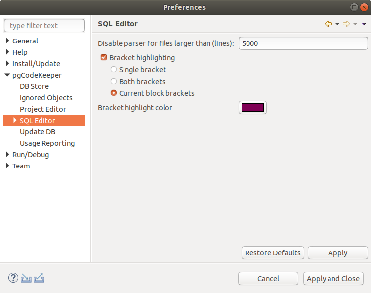

На странице настроек **pgCodeKeeper -> Редактор SQL** Вы можете настроить параметры редактора SQL.

- **Bracket highlight / Подсветка скобок** – включает подсветку скобок в одном из режимов.
- **Single bracket / Одна скобка** – при выборе скобки, подсвечивает парную скобку.
- **Both brackets / Обе скобка** – при выборе скобки, подсвечивает текущую и парную скобку.
- **Current block brackets / Скобки текущего блока** – подсвечивает скобки, между которыми находится курсор.
- **Bracket highlight color / Цвет подсветки скобок** – позволяет выбрать цвет подсветки скобок.

Подсветка синтаксиса
~~~~~~~~~~~~~~~~~~~~

Настройки, управляющие подсветкой синтаксиса.

.. image:: ../images/syntax_highlighting.png

На странице настроек **pgCodeKeeper -> Редактор SQL -> Подсветка синтаксиса** Вы можете установить цвет и стиль шрифта, которым будет отображаться соответствующий синтаксис в SQL редакторе pgCodeKeeper.

Шаблоны редактора SQL
~~~~~~~~~~~~~~~~~~~~~

Создание, удаление и редактирование шаблонов для автоподстановки в SQL редакторе

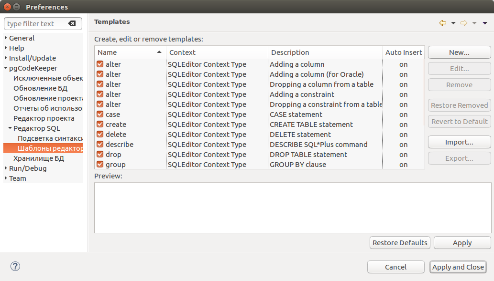

На странице настроек **pgCodeKeeper -> Редактор SQL -> Шаблоны редактора SQL** Вы можете управлять SQL шаблонами, доступными в SQL редакторе pgCodeKeeper. Список доступных действий отображается справа от списка шаблонов.

.. _dbStore :

Хранилище БД
~~~~~~~~~~~~
Настройки, управляющие хранилищем параметров подключения к БД.

На странице настроек **pgCodeKeeper -> DB Store** (Хранилище БД) находится список записей для подключения к базам данных.

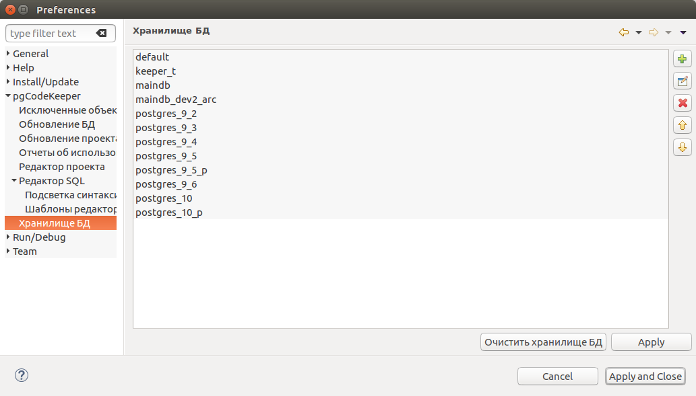

Для добавления хранилища нажать кнопку |add_obj|. Откроется диалог **DB credentials** (Данные подключения к БД), в котором нужно указать параметры данных подключения: хост, порт, имя БД, пользователь, пароль. Название записи можно указать вручную, для этого нужно убрать галочку с чекбокса **Auto-generate** (Автогенерация).

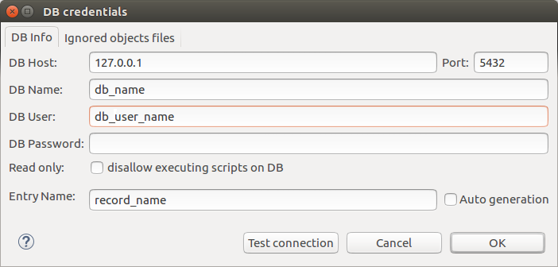

:ref:`ignoreList` можно подключить как внешний файл.

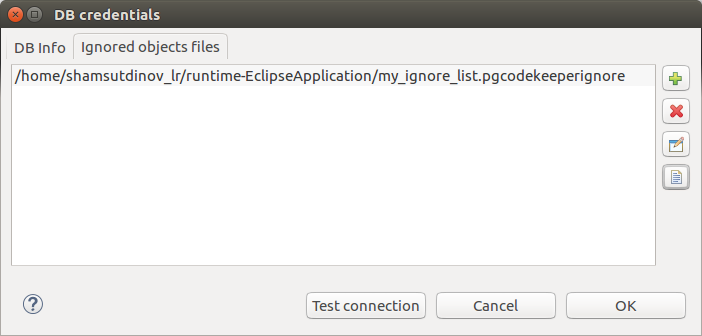

Свойства соединения можно дополнить параметрами указанными по адресу: 
https://jdbc.postgresql.org/documentation/head/connect.html.

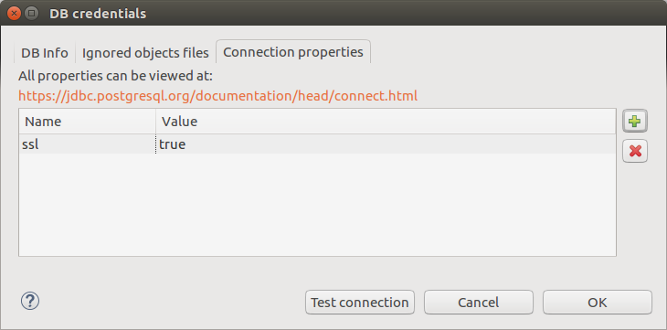

Для добавления хранилища на основе данных из уже созданного хранилища следует выделить объект хранилища баз данных, нажать кнопку |copy|. Откроется диалог **DB credentials** (Данные подключения к БД) в котором можно изменить параметры подключения.

Для добавления хранилища на основе данных из файла **.pgpass**, нажать кнопку |pg_pass|. Откроется диалог в котором необходимо выбрать **.pgpass** файл. Далее откроется диалог  **Pgpass sources list** (Список источников из pgpass):

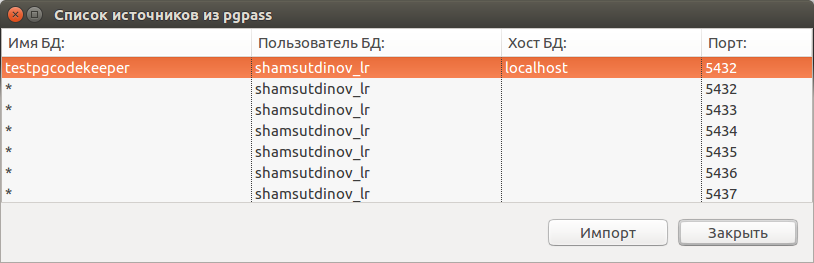

В нем нужно выбрать строку с данными на основе которых будет создаваться хранилище. Откроется диалог **DB credentials** (Данные подключения к БД) в котором можно подтвердить параметры подключения.

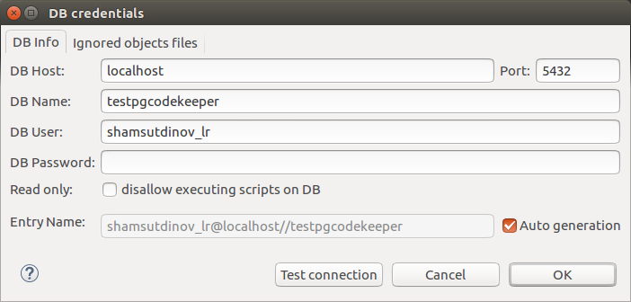

После этого можно закрывать диалог **Pgpass sources list** (Список источников из pgpass).

Для редактирования хранилища выделить объект хранилища баз данных, нажать кнопку |editor_area|. Откроется диалог **DB credentials** (Данные подключения к БД) в котором можно изменить параметры подключения.

Для удаления хранилища выбрать необходимую запись и нажать кнопку |delete|.

.. attention:: Кнопка **Restore Defaults**, на странице настроек, удаляет все записи для подключения к базам данных и создает одну запись default без данных для подключения.

.. attention:: Для сохранения внесенных изменений, в хранилище параметров подключения к БД, на странице настроек необходимо нажать кнопку **Apply** или **Apply and Close**.

.. |copy| image:: ../images/pgcodekeeper_project_view/copy_edit.png
.. |pg_pass| image:: ../images/pgcodekeeper_project_view/pg_pass.png
.. |delete| image:: ../images/pgcodekeeper_project_view/delete_obj.gif
.. |add_obj| image:: ../images/pgcodekeeper_project_view/add_obj.gif
.. |editor_area| image:: ../images/pgcodekeeper_project_view/editor_area.gif
