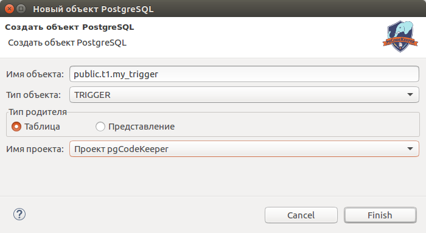

===================================
Редактирование pgCodeKeeper проекта
===================================

Редактирование проекта состоит в изменении содержимого файлов, а также добавлении и удалении файлов и каталогов находящихся под pgCodeKeeper проектом.

.. note:: Ручное редактирование объектов может привести к ошибкам в работе программы и к некорректному применению изменений к БД.

.. image:: ../images/pgcodekeeper_tree.png

Для добавления объектов рекомендуем воспользоваться мастером создания SQL объектов: **File -> New -> SQL Object / Объект SQL** или горячей клавишей (по-умолчанию Alt + Insert).

Выберите проект, тип объекта, введите имя и нажмите **Finish**.

После этого откроется SQL редактор с созданным шаблоном объекта. Если создаваемый объект уже существует, то в редакторе будет открыт этот объект.

Примечание: все возможные данные заполнятся автоматически. Например: если мастер был вызван из контекстного меню файла функции, то автоматически будет выбран текущий проект, тип объекта станет **FUNCTION**, а имя объекта будет частично заполнено именем схемы, в которой находилась функция.

Для редактирования существующего объекта достаточно изменить содержимое его файла в проекте.