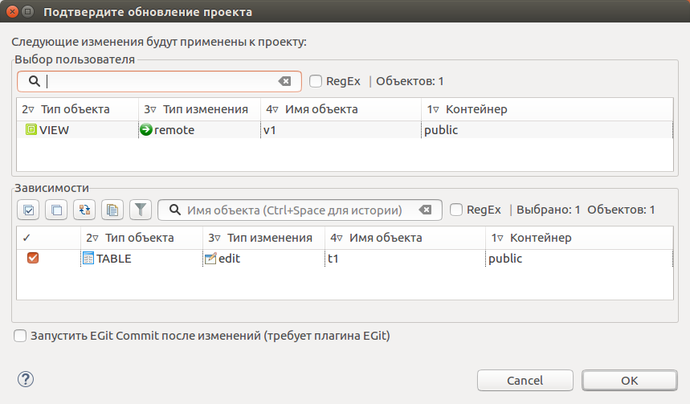

==================
Обновление проекта
==================

На тулбаре выбираем выбираем источник базы данных, на основании которого будет обновляться проект pgCodeKeeper.

На панели задач нажимаем кнопку **Получить изменения  / Get changes**. После недолгого ожидания на панели различий отобразится список различий с указанием типа изменения.

.. image:: ../images/changes_list.png

Выбираем направление изменений **К проекту / To project**, флажками отмечаем необходимые изменения, нажимаем на кнопку **Применить / Apply**, открывается диалог **Подтвердите обновление проекта / Confirm Project Update**.

Проверяем список объектов, выбранных пользователем, и список зависимых объектов. Будьте внимательны! Исключение объектов-зависимостей из обновления может привести к ошибкам или неожиданным результатам.

Если вместо изменения самих объектов необходимо сохранить переопределения их свойств (например, привилегии), то выбираем соответствующую опцию. Выполняется только для объектов с типом изменения **edit**.

Для подтверждения применения изменений к проекту нажать кнопку **OK**. В случае успешного применения изменений в **консоли pgCodeKeeper** появится соответствующее сообщение. 

**Обновление файлов проекта приводит к сбросу списка различий.**