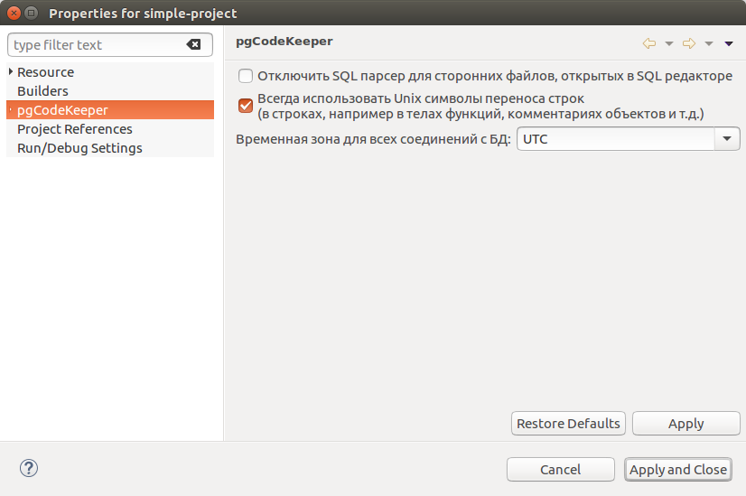
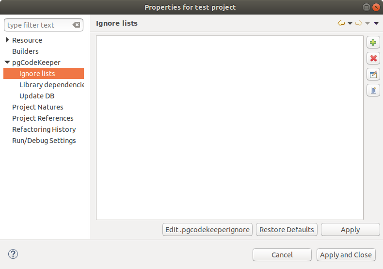
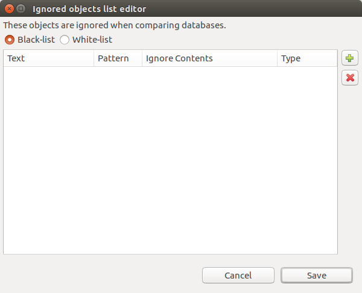
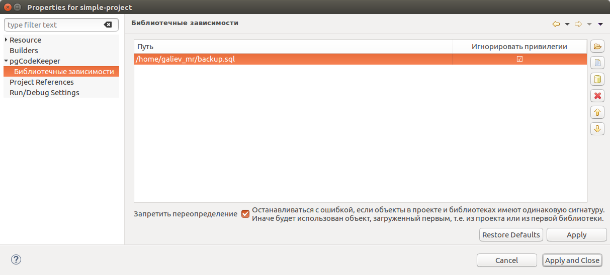

=================
Настройки проекта
=================

Помимо глобальных настроек, применяемых для всего рабочего пространства, существуют возможность настройки отдельного проекта. Для этого из меню проекта выберите пункт **Properties** или нажмите горячую клавишу (по-умолчанию Alt + Enter). Затем выберите пункт **pgCodeKeeper**.

Основные настройки проекта
~~~~~~~~~~~~~~~~~~~~~~~~~~

- **Disable SQL parser for unrelated files opened in SQL Editor / Отключить SQL парсер для сторонних файлов, открытых в SQL редакторе** - позволяет отключить сборщик pgCodeKeeper для файлов проекта, находящихся вне стандартных директорий (SCHEMA и EXTENSION). Это отключает поиск ошибок и ссылок на объекты внутри этих файлов.

- **Use Unix-style newline characters / Использовать Unix символы переноса строк** - позволяет использовать Unix символы переноса в строках, например в телах функций, комментариях объектов и т.д.

- **Timezone for all DB connections / Временная зона для всех соединений с БД** - позволяет выбрать, какую временную зону использовать при соединении с базами данных.

Списки исключений
~~~~~~~~~~~~~~~~~

Настройки, управляющие списками игнор файлов для данного проекта. Подробное описание работы со списками находится в разделе :ref:`ignoreList`.

Для добавления существующего файла нажмите кнопку |add_obj|.

Для удаления файла нажмите кнопку |delete|.

Для создания нового файла нажмите кнопку |add_file|. Будет открыт редактор списка правил, аналогичный редактору на странице глобальных настроек :ref:`ignoredObjects`.

Для редактирования файла нажмите кнопку |editor_area|. Будет открыт редактор списка правил из текущего файла.

.. |add_file| image:: ../images/pgcodekeeper_project_view/add_file.png
.. |delete| image:: ../images/pgcodekeeper_project_view/delete_obj.gif
.. |add_obj| image:: ../images/pgcodekeeper_project_view/add_obj.gif
.. |editor_area| image:: ../images/pgcodekeeper_project_view/editor_area.gif

Библиотечные зависимости
~~~~~~~~~~~~~~~~~~~~~~~~

Настройки, управляющие библиотеками проекта. 

**Библиотеки** - это подключаемые наборы данных объектов, которые "*склеиваются*" с объектами проекта при сравнении с удаленной базой данных. В качестве библиотек можно использовать директории (это может быть как другой pgCodeKeeper проект, так и обычная директория с файлами), дампы или же удаленная база данных. Кроме того, библиотеки возможно упаковать в zip-архив, загрузить на сервер, и подключить, указав URL архива.
Для добавления библиотек воспользуйтесь соответствующими кнопками на боковой панели.

Библиотеки загружаются в порядке, в котором они указаны в списке (самая верхняя библиотека будет загружена первой). Для изменения порядка воспользуйтесь соответствующими кнопками на боковой панели.

Столбец **Owner / Владелец** позволяет установить нового владельца для всех объектов библиотеки. 

.. important:: Если у библиотеки заполнен владелец, он будет отображен вне зависимости от прочих настроек pgCodeKeeper.

Если вы не хотите использовать привилегии и владельцев объектов библиотеки, вы можете отключить их в столбце **Ignore privileges / Игнорировать привилегии**.

.. important:: Если у библиотеки не игнорируются привилегии, они будут отображены вне зависимости от прочих настроек pgCodeKeeper.

**Disallow overrides / Запретить переопределение.** Не исключена ситуация, когда проект и библиотека (или две библиотеки) содержат объекты с одинаковыми именами. Существует два варианта обработки таких ситуаций. При включенной настройке, такие конфликты вызывают остановку сравнения объектов. Отключенная настройка позволяет игнорировать конфликты: будет использован первый загруженный объект. Вне зависимости от настройки будет отображен вид :ref:`overrideView`, в котором будут отображены все конфликты.
