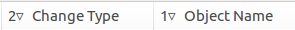

===========================
Сортировка списка изменений
===========================

Для сортировки объектов в списке изменений необходимо кликнуть по заголовку столбца.

По умолчанию используется множественная сортировка. При сортировке по новому столбцу учитывается сортировка по предыдущим выбранным столбцам.

Для сброса сортировки можно кликнуть на заголовок столбца удерживая клавишу Ctrl.

Числа и стрелки в заголовках таблицы показывают порядок и направление сортировки.