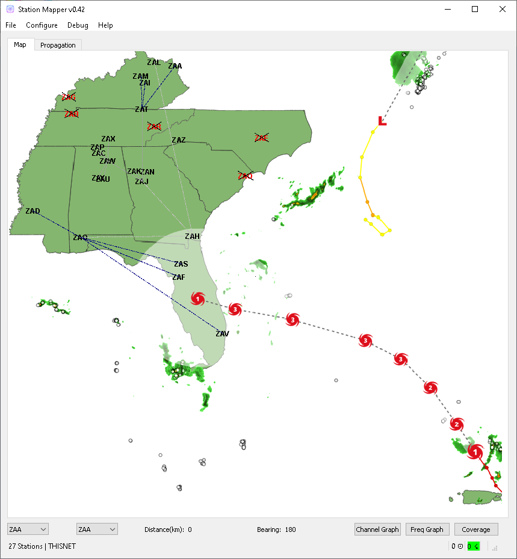
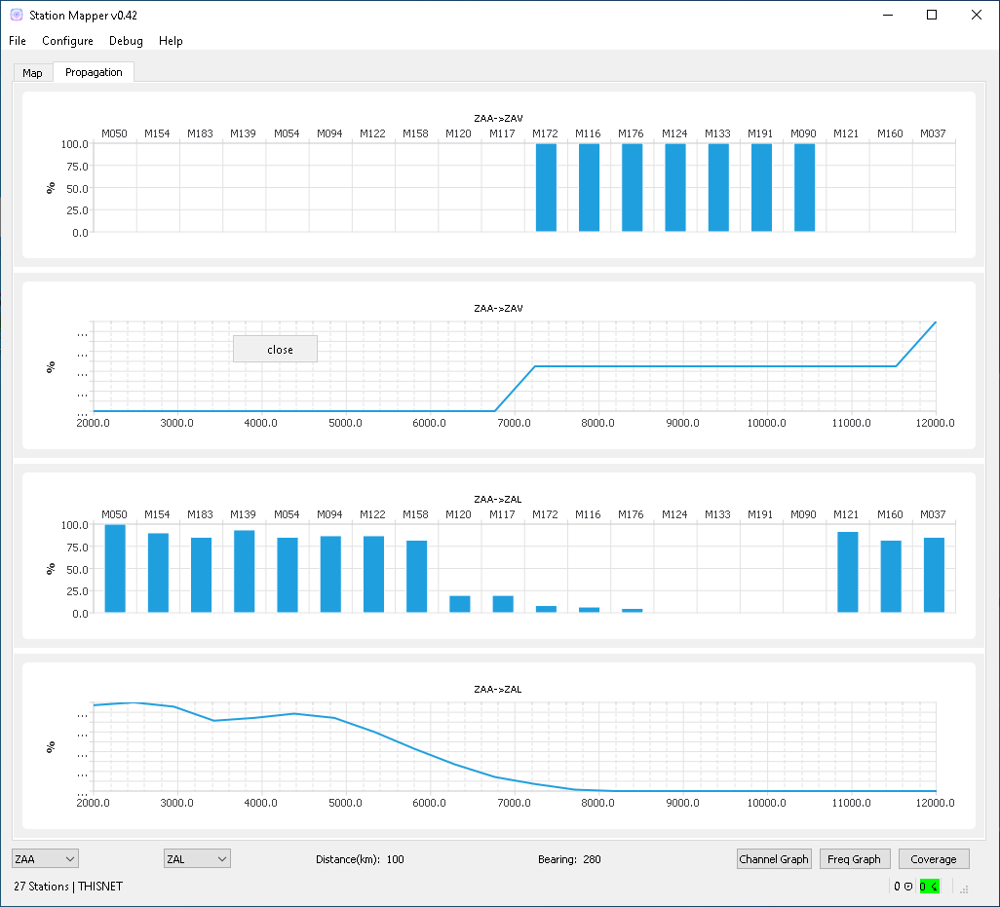
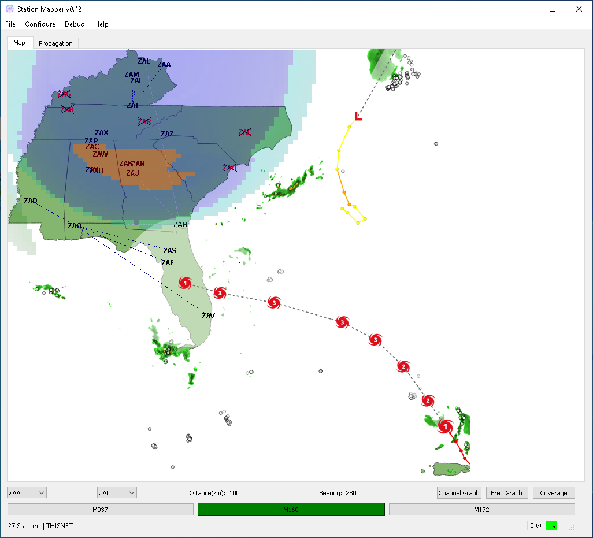

========
Usage
========

Starting StationMapper
--------
	- Start StationMapper from the Windows Start menu.
	- Start your preffered NCS Application
		- NCSPro.exe - StationManagerV2 Suite
		- NCS.exe - ACPDeluxe Suite

ACPDeluxe
--------
	Use ACPDeluxe as described in the instructions provided with it.
	
 - Features
 	- Stations marked as closed (status collumn) apear in red and crossed out.
	- Stations with a 'relayed by' status (T=4ZZ) are connected to their relay by a dot-dash line.
		- Lines are color coded to identify the station relaying. i.e., If ZZZ4ZZ relays 4AA and 4AB the lines running from 4ZZ to 4AA and 4AB are the same color.
		
NCSPro
--------
	Use NCSPro as described in it's documentation.
	NCSPro does not auto-update StationMapper, rather StationMapper watches the PENDING_OUT folder for files with ROSTER in the filename and imports the newest file when changed.
 - Features
	- Planning to add closed and relayed by feature
	- No additional features have been added at this time.
	- SMv2 is depreciated software and further features are not being developed.

Calculator
--------
        - Select two stations by right clicking them or selecting them from the dropdown box.  Distance and bearing are automatically updated each time the station changes.

Propagation Graphs
--------

 - Graphs are calculated based on:
        - The entered noise floor in dBm.
        - Using ideal horizontal dipoles pointed at each other.
        - Using the power selected in staiton parameters.
        - Graphs are displayed on the Progagation tab in the main windows.
        - Right clicking on the graph will allow you to close the graph.
        

Coverage Area Overlays
--------

 - Overlays
        - When you click the Coverage button you will be asked for the channel you want the overlay for.
        - Up to ten overlays can be loaded at one time.
        - You can change the current overlay by clicking on the selector buttons under the claculator row.
        - The button highlighted in green is the currently displayed overlay.
        - Right clicking on an overlay selection button will allow you to close an overlay.

Using the Mouse
--------
	- Left click centers the map in the point clicked.
	- Right click selects that station in the calculator bar.
	- Scroll wheel controls zoom level.
	- Mouse forward and back buttons adjust font scalar.
	- Left click and hold drags the map.

Changing Maps
--------
	From the menu select Configure->Choose Map
	- From this menu select the map you want displayed.
	- Users can create their own maps using an EPSG:3857 projection saved as a bmp (bitmap) file.
		- More info to follow.  This is not a simple process but users who are interested should start by downloading QGIS and creating a EPSG:3857 projection.
