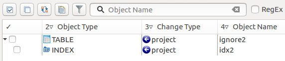
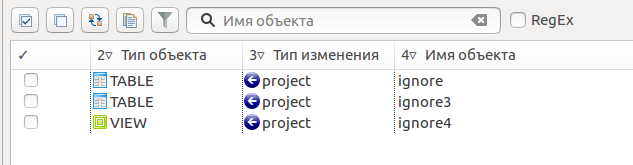
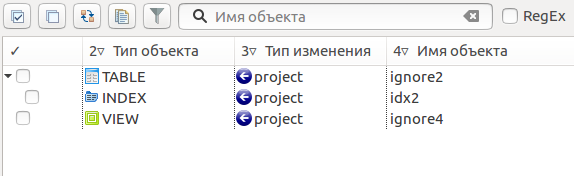
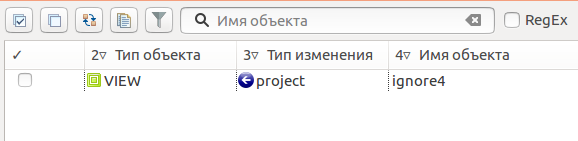
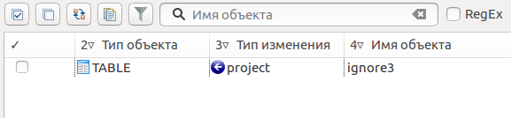

.. _ignoreList :

===================
Черный/белый список
===================

В дополнение к странице настроек :ref:`ignoredObjects`, существует возможность хранить черный/белый список объектов для каждого проекта. Программа автоматически читает такой список из файла **.pgcodekeeperignore** в корне проекта.

Проект находиться тут: directory_with_projects/project

Файл **.pgcodekeeperignore** находится тут: directory_with_projects/.metadata/.plugins/ru.taximaxim.codekeeper.ui/.pgcodekeeperignore

Черный список разрешает показ всего, кроме объектов, указанных в списке. Белый список запрещает показ всех объектов, кроме явно указанных в правилах списка.

.. _whiteBlackCommonUsing :

Черные и белые списки могут использоваться вместе. В таком случае, их правила объединяются в один общий список. Правила, контролирующие отображение одного и того же объекта, складываются в одно общее правило по следующим принципам:

- если "широта" правил различается, то преобладает более широкое правило (включающее в себя сам объект и его содержимое)
- если "широта" правил одинакова, то преобладает скрывающее объект правило

Под "широтой" здесь подразумевает состояние `флага CONTENT ignoreContent`_ (опция `Игнорировать содержимое ignoredObjects`_) .

Синтаксис списков
~~~~~~~~~~~~~~~~~

Формат файлов чувствителен к регистру. Кодировка – UTF-8.

**Черный список**

 | # комментарий
 | SHOW ALL
 | HIDE flag [, ...] identifier [ db=identifier ] [ type=identifier ] # комментарий
 | [ ... ]

**Белый список**

 | # комментарий
 | HIDE ALL
 | SHOW flag [, ...] identifier [ db=identifier ] [ type=identifier ] # комментарий
 | [ ... ]

Где:

flag
        { NONE | REGEX | CONTENT }
identifier
    | строка-идентификатор без кавычек, состоящая из латинских букв, цифр и подчеркиваний; 
    | не может начинаться с цифры; 
    | строка идентификатор не может быть ключевым словом (зарезервированной директивой языка)
    | **или**
    | строка, ограниченная двойными кавычками " или апострофами ' (ограничители в начале и в конце строки должны совпадать); 
    | ограничители, содержащиеся в строке экранируются повтором символа (например: "1""2'3" или '1"2''3')

Флаги:

:REGEX: воспринимает identifier не буквально, а как регулярное выражение
:CONTENT: применяет правило для совпавшего объекта и всего его содержимого
:NONE: не имеет эффекта (применять при отсутствии флагов)

.. _ignoreContent :

*CONTENT* - это правила, триггеры, индексы относящиеся к объекту.

Пример объекта содержащего *CONTENT*:

Дополнительные опции:

- db=identifier правило будет применено только к БД, имя которой подходит под регулярное выражение, заданное этим параметром
- type=identifier правило будет применено только к объектам с указанным типом

Ключевые слова:

 HIDE SHOW ALL REGEX CONTENT NONE
 
Эти слова не могут быть идентификаторами, для их использования они должны быть взяты в кавычки. Зарезервированы только слова, полностью совпадающие по регистру, например Content – разрешенный идентификатор.

Примеры работы с файлом **.pgcodekeeperignore**
"""""""""""""""""""""""""""""""""""""""""""""""

**За основу взят случай для которого учтены все объекты при сравнении БД:**

.. image:: ../images/ignore_list_diff.png

Рассмотрим что произойдет с вышеуказанным случаем при добавлении разных вариантов исключений в файл .pgcodekeeperignore.

**При добавлении исключения по шаблону** (целью является исключение всех объектов в названиях которых есть слово *ignore*):

 | **SHOW ALL**
 | **HIDE REGEX ignore**

из сравниваемых объектов исчезнут все объекты соответствующие шаблону (останется только один объект совпадающий по названию с шаблоном, но он не исчезнет, т.к. содержит в себе объект индекса; для того, чтобы исчез и он необходимо добавить флаг *CONTENT*, что бы получилось следующее - "**HIDE CONTENT,REGEX ignore**").

----

**При добавлении исключения с игнорированием содержимого** (целью является исключение объекта с названием *ignore2* и каким-либо содержимым):

 | **SHOW ALL**
 | **HIDE CONTENT ignore2**

из сравниваемых объектов исчезнут все объекты соответствующие указанному названию и содержащие в себе какие-либо объекты.

----

**При добавлении исключения по типу и шаблону** (целью является исключение всех объектов в названиях которых есть слово *ignore* и тип которых соответствует типу *TABLE*):

 | **SHOW ALL**
 | **HIDE REGEX ignore type=TABLE**

из сравниваемых объектов исчезнут все объекты соответствующие типу и  шаблону (останутся только два объект, один из них не совпадет с указаным типом, второй содержит в себе объект индекса).

----

**При добавлении исключения с указанием названия базы данных, к которой это исключение должно применяться** (целью является исключение всех объектов в названиях которых есть слово *ignore* и тип которых соответствует типу *TABLE*, помимо этого данные исключения должны работать только для указанной базы данных):

 | **SHOW ALL**
 | **HIDE CONTENT,REGEX ignore db=some_name_of_db type=TABLE**

в данном примере указано название другой базы данных, не той с которой ведется работа в данном примере, поэтому все останеться без изменений

.. image:: ../images/ignore_list_diff.png

но если указать название базы данных с которой ведется работ, то из сравниваемых объектов исчезнут все объекты кроме одного объекта, который не соответствует типу.

----

**Использование одновременно черного и белого списков.**

Цель черного списка: исключение всех объектов в названиях которых есть слово *ignore* и исключение объекта с названием *ignore2* и содержимым.

Цель белого списка: убрать из исключенных объектов объект с названием *ignore3*.

Добавление второго списка исключений (в данном случае белого списка) производится через `настройки редактирования хранилища БД dbStore`_ 

.. image:: ../images/new_connection_with_ignore_list.png

файл .pgcodekeeperignore - черный список
 | **SHOW ALL**
 | **HIDE REGEX ignore**
 | **HIDE CONTENT ignore2**

файл myIgnoreList.txt - белый список
 | **HIDE ALL**
 | **SHOW CONTENT ignore3**

Разъяснение по правилам списков:

* *в белом списке благодаря флагу "CONTENT" ignore3 перекрывает по "ширине" условие черного списка "HIDE REGEX ignore"*
* *в черном списке для "ignore2" написано отдельное правило для того, чтобы у белого списка была возможность перекрывать правила черного списка по "ширине"*
 
Таким образом в сравниваемых объектах останется только один объект с названием **ignore3**, т.к. условие белого списка для данного объекта перекрывают по "`ширине whiteBlackCommonUsing`_" условия черного списка.

