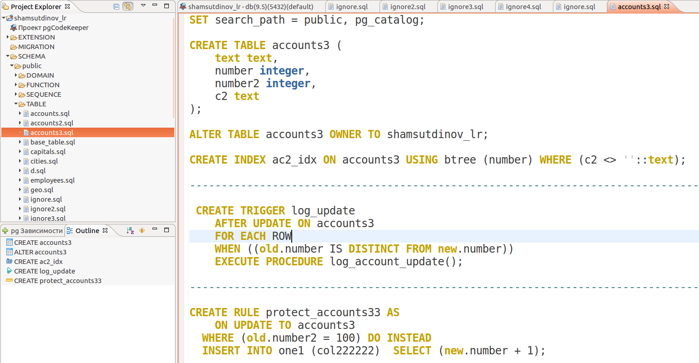
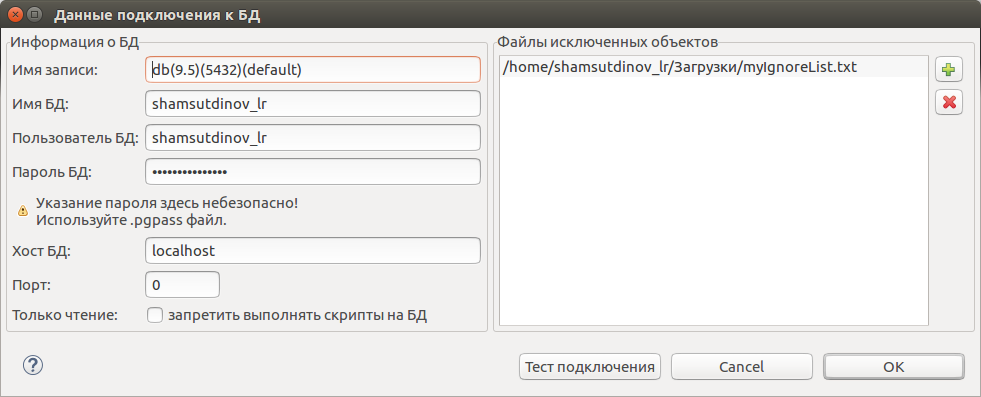

.. _ignoreList :

===================
Черный/белый список
===================

Черный список разрешает показ всех объектов, кроме указанных в правилах списка. Белый список запрещает показ всех объектов, кроме указанных в правилах списка.

.. _whiteBlackCommonList :

**Общий черный/белый список** создается на странице с глобальными настройками в разделе :ref:`ignoredObjects` и распространяет свое действие на все проекты находящиеся в директории проектов. 

Для создания **индивидуального черного/белого списока**, распространяющего свое действие только на определенный проект, в корне проекта необходимо создать файл **.pgcodekeeperignore** и заполнить его правилами согласно `синтаксису списков listSyntax`_. Программа автоматически будет его читать. 

.. attention:: Формат файла **.pgcodekeeperignore** чувствителен к регистру. Кодировка должна быть – UTF-8.

.. _listSyntax :

Синтаксис списков
~~~~~~~~~~~~~~~~~

**Черный список** позволяет отображать только те объекты, которые не указаны в правилах. Он построен таким образом, что первое правило списка разрешает показывать все объекты, а последующие исключают все не нужные.

 | # комментарий
 | SHOW ALL
 | HIDE flag [, ...] objectName [ db=dbName ] [ type=objectType ] # комментарий
 | [ ... ]

===============================================================  ==========================================
                           Правило                                                Описание
===============================================================  ==========================================
 SHOW ALL                                                          разрешает показывать все объекты
 HIDE flag [, ...] objectName [ db=dbName ] [ type=objectType ]    исключает из показа какой-либо объект
===============================================================  ==========================================

Пример разрешения отображения всех объектов кроме объекта с названием "H":

 | SHOW ALL
 | HIDE NONE H

.. csv-table:: 
   :header: "Пример правила", "Описание ", "Область действия правила"
   :widths: 8, 10, 10

   SHOW ALL, разрешение показывать все объекты, .. image:: ../images/white_black_hierarchy_all.png
   HIDE NONE H, исключение объекта H, .. image:: ../images/white_black_hierarchy_none.png

 
**Белый список** работает от обратного, позволяя отображать только те объекты, которые указаны в правилах. Он построен таким образом, что первое правило списка запрещает показывать все объекты, а последующие разрешают все нужные.

 | # комментарий
 | HIDE ALL
 | SHOW flag [, ...] objectName [ db=dbName ] [ type=objectType ] # комментарий
 | [ ... ]

===============================================================  ==========================================
                           Правило                                                Описание
===============================================================  ==========================================
 HIDE ALL                                                          запрещает показывать все объекты
 SHOW flag [, ...] objectName [ db=dbName ] [ type=objectType ]    разрешает для показа какой-либо объект
===============================================================  ==========================================

Пример исключения из отображения всех объектов кроме объекта с названием "H":

 | HIDE ALL
 | SHOW NONE H

.. csv-table::
   :header: "Пример правила", "Описание ", "Область действия правила"
   :widths: 8, 10, 10

   SHOW ALL, запрет на отображение всех объектов, .. image:: ../images/white_black_hierarchy_all.png
   HIDE NONE H, разрешение для показа объекта H, .. image:: ../images/white_black_hierarchy_none.png

----

objectName, dbName, objectType
        данные для поиска объекта

:objectName: название искомого объекта
:dbName: имя базы данных в которой будет искаться объект (опционально)
:objectType: тип искомого объекта (опционально)

.. note:: **objectName, dbName, objectType** *являются идентификаторами и имеют общее синтаксическое правило написания описанное в* **identifier**

.. important:: **objectType** *может быть равен одному из следующих значений: ALL, CONSTRAINT, DOMAIN, EXTENSION, FUNCTION, INDEX, RULE, SCHEMA, SEQUENCE, TABLE, TRIGGER, TYPE, VIEW. "ALL" - означает любой типа объекта.*

.. important:: *На текущий момент нет возможности указывать несколько "objectType" для одного и того же "objectName".*

.. attention:: *На текущий момент нельзя использовать квалифицированные имена в качестве **objectName**.*

.. attention:: "objectType" чувствителен к регистру.

identifier
    | строка-идентификатор без кавычек, состоящая из латинских букв, цифр и подчеркиваний; 
    | не может начинаться с цифры; 
    | строка идентификатор не может быть ключевым словом (зарезервированной директивой языка)
    | **или**
    | строка, ограниченная двойными кавычками " или апострофами ' (ограничители в начале и в конце строки должны совпадать); 
    | ограничители, содержащиеся в строке экранируются повтором символа (например: "1""2'3" или '1"2''3')

----

flag { NONE | REGEX | CONTENT }
        флаг способа поиска объекта

:REGEX: воспринимает identifier не буквально, а как регулярное выражение
:CONTENT: применяет правило для совпавшего объекта и всего его `содержимого ignoreContent`_
:NONE: буквальное совпадение без регулярного выражения и без содержимого

.. _ignoreContent :

*Cодержимое* - это содержимое объекта согласно `иерархии проекта pgCodeKeeper ignoreContentExample`_.

.. csv-table:: Использование флагов
   :header: "Пример правила", "Описание ", "Область действия правила"
   :widths: 8, 10, 10

   HIDE NONE D, исключение только объекта D, .. image:: ../images/white_black_hierarchy_none_content.png
   HIDE CONTENT D, исключение объекта D и его содержимого, .. image:: ../images/white_black_hierarchy_content.png
   HIDE REGEX K, исключение объектов в названии которых есть "K", .. image:: ../images/white_black_hierarchy_regex.png

Для четкого понимания того, что является содержимым объекта рассмотрим пример объектов с содержимым. 

.. _ignoreContentExample :

Объект таблицы "accounts3" будет являться одним из объектов содержащихся в объекте схемы "public", т.к. по иерархии проекта файл таблицы "accounts3" находится внутри папки, которая находится внутрия папки "public".

Для того, чтобы исключить из отображения объект с названием "public" и всего его содержимого нужно использовать следующие правила:

 | SHOW ALL
 | HIDE CONTENT public

В данном примере объект таблицы "accounts3" так же содержит в себе объекты: индекс "ac2_idx", триггер "log_update", правило "protect_accounts33". Для исключения из отображения объекта с названием "accounts3" и всего его содержимого нужно использовать следующие правила:

 | SHOW ALL
 | HIDE CONTENT accounts3

----

Дополнительные опции:

- db=identifier правило будет применено только к БД, имя которой подходит под регулярное выражение, заданное этим параметром
- type=identifier правило будет применено только к объектам с указанным типом

.. attention:: Название базы данных чувствительно к регистру.

----

.. _whiteBlackCommonUsing :

Черные и белые списки могут использоваться вместе. В таком случае, их правила объединяются в один общий список. Правила, контролирующие отображение одного и того же объекта, складываются в одно общее правило по следующим принципам:

- если "широта" правил различается, то преобладает более широкое правило (включающее в себя сам объект и его содержимое)
- если "широта" правил одинакова, то преобладает скрывающее объект правило

Под "широтой" здесь подразумевает состояние `флага CONTENT ignoreContent`_ (опция `Игнорировать содержимое ignoredObjects`_) .

Пример совместного использования черного и белого списков:

файл черного списока
 | **SHOW ALL**
 | **HIDE REGEX K**

файл белого списока
 | **HIDE ALL**
 | **SHOW CONTENT KF**

.. csv-table:: Область действия правила
   :header: "Черный список", "Белый список"
   :widths: 5, 5

   .. image:: ../images/white_black_hierarchy_regex.png, .. image:: ../images/white_black_hierarchy_regex_2.png

В результате будет отображен объект с названием "KF", т.к. условие белого списка для данного объекта перекрывают по "ширине" условия черного списка.

.. note:: *Добавление второго списка исключений производится путем использования `общего списка whiteBlackCommonList`_ или путем добавления внешного списка через `настройки редактирования хранилища БД dbStore`_. При работе в CLI версии для добавления списков исключений используется соответствующая команда (pgcodekeeper-cli -I (--ignore-list) <path> SOURCE DEST).*

----

Ключевые слова:

 HIDE SHOW ALL REGEX CONTENT NONE
 
Эти слова не могут быть идентификаторами, для их использования они должны быть взяты в кавычки. Зарезервированы только слова, полностью совпадающие по регистру, например Content – разрешенный идентификатор.

Пример исключения объекта название, которого полностью совпадает (в том числе и по регистру) с ключевым словом **SHOW**:

 | **SHOW ALL**
 | **HIDE NONE "SHOW"**

Примеры работы с файлом **.pgcodekeeperignore**
"""""""""""""""""""""""""""""""""""""""""""""""
Предположим имеется представление с именем ignore4 и набор из таблиц с именами: ignore, ignore2, ignore3. ignore2 в свою очередь имеет содержимое.

.. image:: ../images/ignore_list_diff.png

.. _whiteBlackFirstExample :

Для того, чтобы исключить все объекты в названиях которых есть слово "ignore" нужно в .pgcodekeeperignore написать следующие правила:

 | **SHOW ALL**
 | **HIDE REGEX ignore**

из сравниваемых объектов исчезнут все объекты соответствующие шаблону, кроме объекта "ignore2", т.к. он содержит в себе объект индекса. Для четкого понимания того, что произошло, рассмотрим этот случай чуть подробнее с точки зрения необходимости наката изменения на базу данных.

.. csv-table::
   :header: "Результат", "Схема "
   :widths: 10, 10

   .. image:: ../images/ignore_list_pattern_diff.png, .. image:: ../images/white_black_hierarchy_none_content.png
   
"ignore2" оказался в той же ситуации, что и объект "D", т.е. сам объект "ignore2" исключен из наката, но его содержимое не исключается из скрипта наката на базу.

В данном примере "ignore2" и его индекс существует только в проекте, поэтому в скрипт наката на базу благодаря зависимостям попадет не только код создания индекса, но и код создания таблицы "ignore2".

В случае если бы "ignore2" уже существовал в базе, а в проекте к таблице был бы добавлен индекс (к уже существующей колонке) и в таблицу были бы внесены изменения (например добавлена колонка) то, в скрипт наката на базу попал бы только код создания индекса.

----

Для того, чтобы исключить объект "ignore2" с содержимым нужно в .pgcodekeeperignore написать следующие правила:

 | **SHOW ALL**
 | **HIDE CONTENT ignore2**

.. csv-table::
   :header: "Результат", "Схема "
   :widths: 10, 10

   .. image:: ../images/ignore_list_content_diff.png, .. image:: ../images/white_black_hierarchy_content.png

"ignore2" оказался в той же ситуации, что и объект "D", поэтому был исключен вместе с содержимым.

----

Для того, чтобы исключить все объекты в названиях которых есть слово "ignore" и тип которых соответствует типу "TABLE" нужно в .pgcodekeeperignore написать следующие правила:

 | **SHOW ALL**
 | **HIDE REGEX ignore type=TABLE**

из сравниваемых объектов исчезнут все объекты соответствующие типу и шаблону (останутся два объект, один из них не совпадет с указаным типом, второй содержит в себе объект индекса как в `первом примере whiteBlackFirstExample`_).

.. csv-table::
   :header: "Результат", "Схема "
   :widths: 10, 10

   .. image:: ../images/ignore_list_type_diff.png, .. image:: ../images/white_black_hierarchy_none_content_example.png

*В схеме в качестве данных для поиска испльзуются: для "objectName" - "K", для "objectType" - "T".*

----

Для того, чтобы исключить все объекты для указанной базы данных в названиях которых есть слово *ignore*, они имею содержимое и тип которых соответствует типу *TABLE* нужно в .pgcodekeeperignore написать следующие правила:

 | **SHOW ALL**
 | **HIDE CONTENT,REGEX ignore db=some_name_of_db type=TABLE**

в вышеуказанных правилах использовано название другой базы данных, не той с которой ведется работа в данном примере, поэтому все останеться без изменений

.. image:: ../images/ignore_list_diff.png

но если указать название базы данных с которой ведется работ, то из сравниваемых объектов исчезнут все объекты кроме одного объекта, который не соответствует типу.

.. csv-table::
   :header: "Результат", "Схема "
   :widths: 10, 10

   .. image:: ../images/ignore_list_db.png, .. image:: ../images/white_black_hierarchy_content_example.png

*В схеме в качестве данных для поиска испльзуются: для "objectName" - "K", для "objectType" - "T".*

----

Для того, чтобы используя черный и белый списки одновременно разрешить отобразить объект с названием "ignore3" нужно написать следующие правила:

файл .pgcodekeeperignore - черный список
 | **SHOW ALL**
 | **HIDE REGEX ignore**
 | **HIDE CONTENT ignore2**

внешний файл myIgnoreList.txt (или `общий список whiteBlackCommonList`_) - белый список
 | **HIDE ALL**
 | **SHOW CONTENT ignore3**

Цель черного списка: исключение всех объектов в названиях которых есть слово *ignore* и исключение объекта с названием *ignore2* с содержимым.

Цель белого списка: убрать из исключенных объектов объект с названием *ignore3*.

.. csv-table::
   :header: "Результат", "Черный список", "Белый список"
   :widths: 10, 5, 5

   .. image:: ../images/ignore_list_black_and_white.png, .. image:: ../images/white_black_hierarchy_2lists_black.png, .. image:: ../images/white_black_hierarchy_2lists_white.png

В результате в сравниваемых объектах останется только один объект с названием "ignore3", т.к. благодаря флагу "CONTENT" для объекта "ignore3" правило белого списка перекрывает по "`ширине whiteBlackCommonUsing`_" правило черного списка "HIDE REGEX ignore".

.. note:: *С целью показать перекрытие правил по "ширине" в черном списке для "ignore2" написано отдельное правило, чтобы у белого списка была возможность перекрывать правила черного списка по "ширине" для объектов "ignore", "ignore3", "ignore4".*
 
.. note:: *Добавление второго списка исключений (в данном случае белого списка) производится путем использования `общего списка whiteBlackCommonList`_ или путем добавления внешного списка через `настройки редактирования хранилища БД dbStore`_.*

