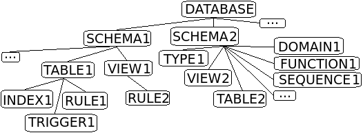

.. _ignoreList :

===========================
Список исключаемых объектов
===========================

Список исключаемых объектов - это список объектов, которые не должны или наоборот должны отображаться при сравнении баз данных.

.. attention:: Объекты, отфильтрованные данными списками, участвуют в сравнении и могут попасть в итоговый скрипт миграции по зависимости.

Существует два типа списков исключаемых объектов:

черный список
        разрешает отображение всех объектов, кроме указанных в правилах списка;

белый список
        работает противоположно черному, запрещает отображение всех объектов, кроме указанных в правилах списка.

В каждом проекте можно создать **список исключаемых объектов**, распространяющий свое действие только на данный проект, для этого в корне проекта необходимо создать файл **.pgcodekeeperignore** и заполнить его правилами согласно синтаксису списков. 

.. attention:: Формат файла **.pgcodekeeperignore** чувствителен к регистру. Кодировка должна быть – UTF-8.

Ниже, в разделе :ref:`listSyntax` рассмотрим правила формирования файла **.pgcodekeeperignore**.

.. note:: В дополнении к файлу **.pgcodekeeperignore**, в графической версии pgCodeKeeper существует **общий список исключаемых объектов**. Этот список распространяет свое действие на все проекты, находящиеся в директории проектов. Заполнить его можно на странице с глобальными настройками в разделе :ref:`ignoredObjects`.

.. _listSyntax :

Синтаксис списков
~~~~~~~~~~~~~~~~~

Файл **.pgcodekeeperignore** состоит из двух частей:

заголовок
        является обязательным правилом, занимает первую строку и определяет тип списка;

правила
        строки правил запрещающие или разрешающие (в зависимости от типа списка) показывать какой-либо объект.

**Черный список** позволяет отображать только те объекты, которые не указаны в правилах. Он построен таким образом, что заголовок списка разрешает показывать все объекты, а последующие за ним правила исключают объекты из отображения.

::

 # комментарий
 SHOW ALL
 HIDE flag [, ...] objectName [ db=dbName ] [ type=objectType [, ...] ] # комментарий
 [ ... ]

**Описание частей черного списка**

.. table:: 

    +--------------------------------------------------------------------------+---------------------------+
    | Строка файла .pgcodekeeperignore                                         | Описание                  |
    +==========================================================================+===========================+
    | ``SHOW ALL``                                                             | | [заголовок]             |
    |                                                                          | | разрешает показывать    |
    |                                                                          | | все объекты             |
    +--------------------------------------------------------------------------+---------------------------+
    | ``HIDE flag [, ...] objectName [ db=dbName ][ type=objectType[, ...] ]`` | | [правило]               |
    |                                                                          | | исключает из отображения|
    |                                                                          | | какой-либо объект       |
    +--------------------------------------------------------------------------+---------------------------+

**Белый список** работает от обратного, позволяя отображать только те объекты, которые указаны в правилах. Он построен таким образом, что заголовок списка запрещает показывать все объекты, а последующие за ним правила разрешают объекты для отображения.

::

 # комментарий
 HIDE ALL
 SHOW flag [, ...] objectName [ db=dbName ] [ type=objectType [, ...] ] # комментарий
 [ ... ]

**Описание частей белого списка**

.. table:: 

    +---------------------------------------------------------------------------+----------------------------+
    | Строка файла .pgcodekeeperignore                                          | Описание                   |
    +===========================================================================+============================+
    | ``HIDE ALL``                                                              | | [заголовок]              |
    |                                                                           | | запрещает показывать     |
    |                                                                           | | все объекты              |
    +---------------------------------------------------------------------------+----------------------------+
    | ``SHOW flag [, ...] objectName [ db=dbName ] [ type=objectType [, ...] ]``| | [правило]                |
    |                                                                           | | разрешает для отображения|
    |                                                                           | | какой-либо объект        |
    +---------------------------------------------------------------------------+----------------------------+

Где:

objectName, dbName, objectType
        идентификаторы для поиска объекта имеющие общее синтаксическое правило написания описанное в **identifier**

=================  =================================================================
 **objectName**     название искомого объекта (является обязательной частью правила)
 **dbName**         имя базы данных в которой будет искаться объект (опционально)
 **objectType**    тип искомого объекта (опционально)
=================  =================================================================

.. important:: **objectType** может быть равен одному из следующих значений: USER, ROLE, ASSEMBLY, SCHEMA, EXTENSION, TYPE, DOMAIN, SEQUENCE, FUNCTION, PROCEDURE, OPERATOR, FTS_PARSER, FTS_TEMPLATE, FTS_DICTIONARY, FTS_CONFIGURATION, TABLE, CONSTRAINT, INDEX, VIEW, TRIGGER, RULE.

identifier
    | строка-идентификатор без кавычек, состоящая из латинских букв, цифр и подчеркиваний; 
    | не может начинаться с цифры; 
    | строка идентификатор не может быть ключевым словом (зарезервированной директивой языка)
    | **или**
    | строка, ограниченная двойными кавычками ``"`` или апострофами ``'`` (ограничители в начале и в конце строки должны совпадать); 
    | ограничители, содержащиеся в строке экранируются повтором символа (например: ``"1""2'3"`` или ``'1"2''3'``)

.. attention:: На текущий момент нельзя использовать квалифицированные имена в качестве "objectName".

.. attention:: "objectType" чувствителен к регистру.

flag { NONE | REGEX | CONTENT }
        флаг способа поиска объекта

=============  ================================================================
 **REGEX**     воспринимает objectName как регулярное выражение [1]_
 **CONTENT**   применяет правило для совпавшего объекта и всего его содержимого
 **NONE**      строгое совпадение без регулярного выражения и без содержимого
=============  ================================================================

.. [1] Флаг **REGEX** позволяет правилу производить поиск частичных совпадений с регулярным выражением.

*Cодержимое* - это содержимое объекта согласно иерархии проекта pgCodeKeeper:

Например для "TABLE1" содержимым будет являться "INDEX1", "TRIGGER1" и "RULE1".

Дополнительные опции:

- db=dbName правило будет применено только к БД, имя которой подходит под регулярное выражение, заданное этим параметром
- type=objectType правило будет применено только к объектам с указанным типом

.. note:: Для указания нескольких типов для одного и того же объекта необходимо написать их через запятую.

.. attention:: Название базы данных чувствительно к регистру.

**Примеры для белого списка**

.. table:: 

    +------------------------+--------------------------------------------------------------+
    | Пример и описание      | Область действия                                             |
    +========================+==============================================================+
    | | **HIDE ALL**         | .. image:: ../images/white_black_hierarchy_all_hide.png      |
    | | [заголовок]          |                                                              |
    | | запрещает            |                                                              |
    |   отображение          |                                                              |
    | | всех объектов        |                                                              |
    +------------------------+--------------------------------------------------------------+
    | | **HIDE ALL**         | .. image:: ../images/white_black_hierarchy_regex_show.png    |
    | | [заголовок]          |                                                              |
    | | запрещает            |                                                              |
    |   отображение          |                                                              |
    | | всех объектов        |                                                              |
    | |                      |                                                              |
    | | **SHOW REGEX K**     |                                                              |
    | | [правило]            |                                                              |
    | | разрешает отображать |                                                              |
    | | объекты которые      |                                                              |
    |   частично             |                                                              |
    | | попадают под         |                                                              |
    |   регулярное           |                                                              |
    | | выражение "K"        |                                                              |
    +------------------------+--------------------------------------------------------------+
    | | **HIDE ALL**         | .. image:: ../images/white_black_hierarchy_content_show.png  |
    | | [заголовок]          |                                                              |
    | | запрещает            |                                                              |
    |   отображение          |                                                              |
    | | всех объектов        |                                                              |
    | |                      |                                                              |
    | | **SHOW CONTENT D**   |                                                              |
    | | [правило]            |                                                              |
    | | разрешает отображать |                                                              |
    | | объект D и его       |                                                              |
    | | содержимое           |                                                              |
    +------------------------+--------------------------------------------------------------+
    | | **HIDE ALL**         | .. image:: ../images/white_black_hierarchy_none_show.png     |
    | | [заголовок]          |                                                              |
    | | запрещает            |                                                              |
    |   отображение          |                                                              |
    | | всех объектов        |                                                              |
    | |                      |                                                              |
    | | **SHOW NONE D**      |                                                              |
    | | [правило]            |                                                              |
    | | разрешает отображать |                                                              |
    | | только объект D      |                                                              |
    +------------------------+--------------------------------------------------------------+

**Примеры для черного списка**

.. table:: 

    +------------------------+--------------------------------------------------------------+
    | Пример и описание      | Область действия                                             |
    +========================+==============================================================+
    | | **SHOW ALL**         | .. image:: ../images/white_black_hierarchy_all_show.png      |
    | | [заголовок]          |                                                              |
    | | разрешает            |                                                              |
    |   показывать           |                                                              |
    | | все объекты          |                                                              |
    +------------------------+--------------------------------------------------------------+
    | | **SHOW ALL**         | .. image:: ../images/white_black_hierarchy_regex_hide.png    |
    | | [заголовок]          |                                                              |
    | | разрешает            |                                                              |
    |   показывать           |                                                              |
    | | все объекты          |                                                              |
    | |                      |                                                              |
    | | **HIDE REGEX K**     |                                                              |
    | | [правило]            |                                                              |
    | | исключает объекты    |                                                              |
    | | которые частично     |                                                              |
    | | попадают под         |                                                              |
    |   регулярное           |                                                              |
    | | выражение "K"        |                                                              |
    +------------------------+--------------------------------------------------------------+
    | | **SHOW ALL**         | .. image:: ../images/white_black_hierarchy_content_hide.png  |
    | | [заголовок]          |                                                              |
    | | разрешает            |                                                              |
    |   показывать           |                                                              |
    | | все объекты)         |                                                              |
    | |                      |                                                              |
    | | **HIDE CONTENT D**   |                                                              |
    | | [правило]            |                                                              |
    | | исключает объект D   |                                                              |
    | | и его содержимое     |                                                              |
    +------------------------+--------------------------------------------------------------+
    | | **SHOW ALL**         | .. image:: ../images/white_black_hierarchy_none_hide.png     |
    | | [заголовок]          |                                                              |
    | | разрешает            |                                                              |
    |   показывать           |                                                              |
    | | все объекты          |                                                              |
    | |                      |                                                              |
    | | **HIDE NONE D**      |                                                              |
    | | [правило]            |                                                              |
    | | исключает только     |                                                              |
    | | объект D             |                                                              |
    +------------------------+--------------------------------------------------------------+

----

Ключевые слова:

 HIDE SHOW ALL REGEX CONTENT NONE
 
Эти слова не могут быть идентификаторами, для их использования они должны быть взяты в кавычки. Зарезервированы только слова, полностью совпадающие по регистру, например Content – разрешенный идентификатор.

Пример исключения объекта название, которого полностью совпадает (в том числе и по регистру) с ключевым словом **SHOW**:

::

 SHOW ALL
 HIDE NONE "SHOW"

.. _whiteBlackCommonUsing :

Совместное использование черного и белого списков
~~~~~~~~~~~~~~~~~~~~~~~~~~~~~~~~~~~~~~~~~~~~~~~~~

Черные и белые списки могут использоваться вместе. В таком случае, их правила объединяются в один общий список. Правила, контролирующие отображение одного и того же объекта, складываются в одно общее правило по следующим принципам:

- если "широта" правил различается, то преобладает более широкое правило (включающее в себя сам объект и его содержимое)
- если "широта" правил одинакова, то преобладает скрывающее объект правило

"Широта" правила - это включение или не включение, в область действия правила, содержимого того или иного объекта, т.е. состояние флага CONTENT (для **общего списка** графической версии pgCodeKeeper, это опция "Игнорировать содержимое" описанная в разделе :ref:`ignoredObjects`).

Пример совместного использования черного и белого списков:

файл черного списка

::

 SHOW ALL
 HIDE REGEX K

файл белого списка

::

 HIDE ALL
 SHOW CONTENT KF

**Область действия правила**

.. csv-table::
   :header: "Черный список", "Белый список"
   :widths: 5, 5

   .. image:: ../images/white_black_hierarchy_regex_hide.png, .. image:: ../images/white_black_hierarchy_regex_show_2.png

В результате будет отображен объект с названием "KF", т.к. условие белого списка для данного объекта перекрывают по "ширине" условия черного списка.

.. note:: При работе в графической версии pgCodeKeeper добавление второго списка исключений производится путем использования **общего списка исключаемых объектов** или путем добавления внешного списка через :ref:`dbStore`. :ref:`cliVersion` pgCodeKeeper позволяет добавлять дополнительные списки исключений, с помощью команды: ``pgcodekeeper-cli --ignore-list <path> SOURCE DEST``.

Примеры работы с файлом **.pgcodekeeperignore**
~~~~~~~~~~~~~~~~~~~~~~~~~~~~~~~~~~~~~~~~~~~~~~~
Предположим имеется представление с именем ignore4 и набор из таблиц с именами: ignore, ignore2, ignore3. ignore2 в свою очередь имеет содержимое.

.. csv-table::
   :header: "Результат", "Схема "
   :widths: 5, 5

   .. image:: ../images/ignore_list_diff.png, .. image:: ../images/white_black_hierarchy_example_project_base.png

Для того, чтобы исключить все объекты частично попадающие под регулярное выражение "ignore" нужно в .pgcodekeeperignore написать следующие правила:

::

 SHOW ALL
 HIDE REGEX ignore

.. csv-table::
   :header: "Результат", "Схема "
   :widths: 5, 5

   .. image:: ../images/ignore_list_pattern_diff.png, .. image:: ../images/white_black_hierarchy_example_project_regex.png
   

----

Для того, чтобы исключить объект "ignore2" с содержимым нужно в .pgcodekeeperignore написать следующие правила:

::

 SHOW ALL
 HIDE CONTENT ignore2

.. csv-table::
   :header: "Результат", "Схема "
   :widths: 5, 5

   .. image:: ../images/ignore_list_content_diff.png, .. image:: ../images/white_black_hierarchy_example_project_content.png

----

Для того, чтобы исключить все объекты с типом "TABLE", частично попадающие под регулярное выражение "ignore" нужно в .pgcodekeeperignore написать следующие правила:

::

 SHOW ALL
 HIDE REGEX ignore type=TABLE

.. csv-table::
   :header: "Результат", "Схема "
   :widths: 5, 5

   .. image:: ../images/ignore_list_type_diff.png, .. image:: ../images/white_black_hierarchy_example_project_regex_type.png

----

Для того, чтобы исключить все объекты частично попадающие под регулярное выражение "ignore", с типом *TABLE* и содержимым для указанной базы данных нужно в .pgcodekeeperignore написать следующие правила:

::

 SHOW ALL
 HIDE CONTENT,REGEX ignore db=name_of_other_db type=TABLE

в вышеуказанных правилах использовано название другой базы данных, не той с которой ведется работа в данном примере, поэтому все останется без изменений

.. csv-table::
   :header: "Результат", "Схема "
   :widths: 5, 5

   .. image:: ../images/ignore_list_diff.png, .. image:: ../images/white_black_hierarchy_example_project_base.png

но если указать название базы данных с которой ведется работа, то из отображаемых объектов исчезнут все объекты кроме одного, который не соответствует типу.

::

 SHOW ALL
 HIDE CONTENT,REGEX ignore db=db1 type=TABLE

.. csv-table::
   :header: "Результат", "Схема "
   :widths: 5, 5

   .. image:: ../images/ignore_list_db.png, .. image:: ../images/white_black_hierarchy_example_project_content_regex_db_type.png

----

Для того, чтобы используя черный и белый списки одновременно разрешить отобразить объект "ignore2" нужно написать следующие правила:

файл .pgcodekeeperignore - черный список

::

 SHOW ALL
 HIDE REGEX ignore

дополнительный файл списка исключаемых объектов - белый список

::

 HIDE ALL
 SHOW CONTENT ignore2

.. note:: Добавление дополнительного списка описано в разделе :ref:`whiteBlackCommonUsing`.

Цель черного списка: исключение всех объектов частично попадающих под регулярное выражение "ignore".

Цель белого списка: убрать из исключенных объектов объект "ignore2".

.. csv-table::
   :header: "Результат", "Черный список", "Белый список"
   :widths: 3, 3, 3

   .. image:: ../images/ignore_list_pattern_diff.png, .. image:: ../images/white_black_hierarchy_example_project_regex.png, .. image:: ../images/white_black_hierarchy_example_project_content_white.png

В результате в сравниваемых объектах останется только объект "ignore2", т.к. благодаря флагу "CONTENT" для объекта "ignore2" правило белого списка перекрывает по "ширине" правило черного списка "HIDE REGEX ignore".

.. note:: Взаимодействие правил разных списков, контролирующих отображение одного и того же объекта, описано в разделе :ref:`whiteBlackCommonUsing`.
