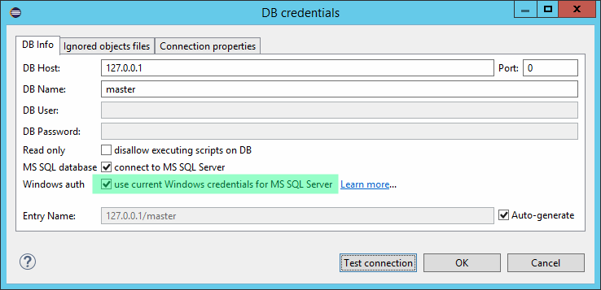

======================
Windows аутентификация
======================

При работе под ОС Windows для подключения к серверам БД Microsoft SQL доступен режим Windows аутентификации. Это позволяет вместо явного указания имени пользователя и пароля использовать данные текущего пользователя Windows, либо пользователя, от имени которого запущена программа.

Для включения режима Windows аутентификации достаточно включить соответствующую опцию в настройках подключения к БД. В случае использования CLI версии требуется указать параметр ``integratedSecurity`` в `строке подключения <https://docs.microsoft.com/ru-ru/sql/connect/jdbc/building-the-connection-url#Connectingintegrated>`_.

Примеры использования Windows аутентификации в GUI и CLI:

::

  pgcodekeeper-cli.bat --ms-sql jdbc:sqlserver://127.0.0.1;databaseName={master};integratedSecurity=true NUL

Конфигурация системы
~~~~~~~~~~~~~~~~~~~~

Для использования Windows аутентификации приложению должна быть доступна DLL Microsoft JDBC драйвера, *sqljdbc_auth.dll*. Ее следует извлечь из `пакета драйвера <https://www.microsoft.com/ru-RU/download/details.aspx?id=57175>`_ и поместить в директорию, присутствующую в переменной окружения *PATH*, либо в свойстве JVM *java.library.path*. Битность библиотеки должна соответствовать битности используемой вами версии Eclipse.

Наиболее простой и универсальный вариант – сохранить библиотеку в директории *C:\\Windows\\System32\\*. В 64-битных системах эта директория содержит 64-битные библиотеки. В случае использования 32-битного Eclipse на 64-битной системе, 32-битную библиотеку следует сохранить в директорию *C:\\Windows\\SysWOW64\\*.
